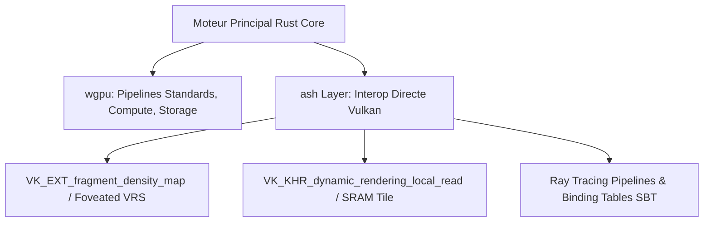

# Master Blueprint Encyclopédique : Architecture d'un Moteur de Rendu 3D Hybride Extrême (VR Photoréaliste ↔ Mobiles Restreints)

> **Document de Référence Ultime & Encyclopédie Technologique**  
> *Agrégation 100 % exhaustive de la recherche publique (SIGGRAPH, EGSR, IEEE), des brevets industriels, de la logique spéculative et des retours d'ingénierie privée (NVIDIA Research, AMD RDNA, Epic Games, Meta Reality Labs, Embark Studios, Oxide Games, Google Filament, thatgamecompany).*

---

## Sommaire Général

1. [Vision Stratégique & Paradigme des Feature Levels](#1-vision-stratégique--paradigme-des-feature-levels)
2. [Axe 1 : Pipeline Géométrique GPU-Driven & Virtual Geometry (Nanite-Style)](#2-axe-1--pipeline-géométrique-gpu-driven--virtual-geometry-nanite-style)
   - [1.1 Work Graphs D3D12 / Vulkan Task Graphs](#11-work-graphs-d3d12--vulkan-task-graphs)
   - [1.2 Routing Multi-BRDF & Suppression des Uber-Shaders](#12-routing-multi-brdf--suppression-des-uber-shaders)
   - [1.3 Mesh Shaders & Culling Hiérarchique 2-Passes (Hi-Z)](#13-mesh-shaders--culling-hiérarchique-2-passes-hi-z)
   - [1.4 Virtual Geometry & Software Rasterizer Compute 64-bits (`R64Uint`)](#14-virtual-geometry--software-rasterizer-compute-64-bits-r64uint)
3. [Axe 2 : Stéréoscopie VR, Object-Space Shading & Anti-Aliasing sans TAA](#3-axe-2--stéréoscopie-vr-object-space-shading--anti-aliasing-sans-taa)
   - [2.1 Le Cauchemar du TAA en VR (Flou, Rivalité Binoculaire & Cinétose)](#21-le-cauchemar-du-taa-en-vr-flou-rivalité-binoculaire--cinétose)
   - [2.2 Object-Space / Texture-Space Shading (Karis, AMD, Meta, Oxide)](#22-object-space--texture-space-shading-karis-amd-meta-oxide)
   - [2.3 Élimination du Shimmering par LEAN / LEADR Mapping](#23-élimination-du-shimmering-par-lean--leadr-mapping)
4. [Axe 3 : Transparence Photoréaliste, Verre et Caustiques Optiques](#4-axe-3--transparence-photoréaliste-verre-et-caustiques-optiques)
   - [3.1 La Réalité du Verre en Temps Réel (Tricheries AAA & PSR)](#31-la-réalité-du-verre-en-temps-réel-tricheries-aaa--psr)
   - [3.2 Order-Independent Transparency (OIT) : WBOIT, MBOIT & Linked Lists](#32-order-independent-transparency-oit--wboit-mboit--linked-lists)
   - [3.3 Caustiques Temps Réel : AAPS (Photon Scattering) & Ray Differentials](#33-caustiques-temps-réel--aaps-photon-scattering--ray-differentials)
5. [Axe 4 : Transport Lumineux, GI et Path Tracing (ReSTIR PT, Lumen, DDGI, Radiance Cascades)](#5-axe-4--transport-lumineux-gi-et-path-tracing-restir-pt-lumen-ddgi-radiance-cascades)
   - [4.1 ReSTIR PT & Formalisme Mathématique du GRIS](#41-restir-pt--formalisme-mathématique-du-gris)
   - [4.2 Analyse de Lumen (Unreal Engine 5) et ses Limites VR](#42-analyse-de-lumen-unreal-engine-5-et-ses-limites-vr)
   - [4.3 DDGI (Dynamic Diffuse Global Illumination) avec Probe Fields](#43-ddgi-dynamic-diffuse-global-illumination-avec-probe-fields)
   - [4.4 Radiance Cascades (Sannikov / PoE2) : L'Éclairage à Zéro Latence](#44-radiance-cascades-sannikov--poe2--léclairage-à-zéro-latence)
   - [4.5 Débruiteurs Temporels et Spatiaux (NRD, SVGF, OIDN)](#45-débruiteurs-temporels-et-spatiaux-nrd-svgf-oidn)
6. [Axe 5 : Représentation Hybride 3D Gaussian Splatting (3DGS) & VR](#6-axe-5--représentation-hybride-3d-gaussian-splatting-3dgs--vr)
   - [5.1 Compression SPZ (`glTF KHR_gaussian_splatting_compression_spz`)](#51-compression-spz-gltf-khr_gaussian_splatting_compression_spz)
   - [5.2 EAG-PT : Découplage Émissif & Relighting PBR sur Splats](#52-eag-pt--découplage-émissif--relighting-pbr-sur-splats)
   - [5.3 3DGRT : Lancer de Rayons BVH sur Tiny Gaussians](#53-3dgrt--lancer-de-rayons-bvh-sur-tiny-gaussians)
7. [Axe 6 : Hydrodynamique Photoréaliste des Fluides](#7-axe-6--hydrodynamique-photoréaliste-des-fluides)
   - [6.1 Position-Based Fluids (PBF) & Solveur MLS-MPM sur GPU](#61-position-based-fluids-pbf--solveur-mls-mpm-sur-gpu)
   - [6.2 Famille SPH (PCISPH, IISPH, DFSPH) & Grilles Eulériennes](#62-famille-sph-pcisph-iisph-dfsph--grilles-eulériennes)
   - [6.3 Screen-Space Fluid Rendering (SSFR) & Filtre Bilatéral Étroit](#63-screen-space-fluid-rendering-ssfr--filtre-bilatéral-étroit)
8. [Axe 7 : Volumétrie, Particules & Direction Artistique (DA)](#8-axe-7--volumétrie-particules--direction-artistique-da)
   - [7.1 Brouillard Volumétrique par Froxels (Frostbite / Wronski / Hillaire)](#71-brouillard-volumétrique-par-froxels-frostbite--wronski--hillaire)
   - [7.2 Ciel, Atmosphère & Nuages Volumétriques (Nubis / Decima)](#72-ciel-atmosphère--nuages-volumétriques-nubis--decima)
   - [7.3 Adaptive Volumetric Shadow Maps (AVSM)](#73-adaptive-volumetric-shadow-maps-avsm)
   - [7.4 Direction Artistique Technique Mobile : Leçons de *Sky: Children of the Light*](#74-direction-artistique-technique-mobile--leçons-de-sky-children-of-the-light)
9. [Axe 8 : Architecture Mobile Tile-Based (TBR/TBDR) & Vulkan Bas-Niveau](#9-axe-8--architecture-mobile-tile-based-tbrtbdr--vulkan-bas-niveau)
   - [8.1 Anatomie des GPU Mobiles & Goulots d'Étranglement Mémoire / Thermique](#81-anatomie-des-gpu-mobiles--goulots-détranglement-mémoire--thermique)
   - [8.2 Vulkan 1.4 `VK_KHR_dynamic_rendering_local_read` & Subpass Merging](#82-vulkan-14-vk_khr_dynamic_rendering_local_read--subpass-merging)
   - [8.3 Variable Rate Shading (VRS) & Foveated Rendering (FFR / ETFR)](#83-variable-rate-shading-vrs--foveated-rendering-ffr--etfr)
10. [Axe 9 : Écosystème et Stack Technologique Rust (Analyse 2025/2026)](#10-axe-9--écosystème-et-stack-technologique-rust-analyse-20252026)
    - [9.1 Évaluation Approfondie de `wgpu` (v30)](#91-évaluation-approfondie-de-wgpu-v30)
    - [9.2 Architecture Hybride `wgpu` + Couche `ash` (Vulkan Direct)](#92-architecture-hybride-wgpu--couche-ash-vulkan-direct)
    - [9.3 Analyse des Projets de Référence (kajiya, Bevy 0.16+, rust-gpu, OpenXR)](#93-analyse-des-projets-de-référence-kajiya-bevy-016-rust-gpu-openxr)
11. [Axe 10 : Optimisations Latence VR, Matrice de Décisions & Feuille de Route](#11-axe-10--optimisations-latence-vr-matrice-de-décisions--feuille-de-route)

---

## 1. Vision Stratégique & Paradigme des Feature Levels

### La Vérité Empirique de l'Industrie
Aucun moteur graphique universel ne peut faire tourner du Path Tracing stochastique lourd en VR tout en fonctionnant sur un téléphone portable bas de gamme via la même chaîne d'exécution.

Epic Games l'indique noir sur blanc dans la documentation officielle d'Unreal Engine 5 :
> *« Lumen does not currently support Virtual Reality (VR) systems... the high frame rates and resolutions required by VR make dynamic global illumination a poor fit. »*

La création du moteur repose sur une **Architecture à Niveaux de Fonctionnalités (*Feature Levels*) régie par un Render Graph unifié**, basculant dynamiquement les pipelines d'exécution selon le profil matériel détecté :

```
                                  +---------------------------------------+
                                  |         ENGINE RENDER GRAPH           |
                                  +---------------------------------------+
                                                      |
                  +-----------------------------------+-----------------------------------+
                  |                                                                       |
                  v                                                                       v
     [ FEATURE LEVEL 3 : HIGH PC VR ]                                      [ FEATURE LEVEL 1 : LOW MOBILE ]
     - Path Tracing ReSTIR PT / GRIS                                       - Forward Clustered + MSAA 4x
     - Object-Space Shading (Stéréo Amorti)                                - Vulkan Local Read (SRAM 0B VRAM G-Buffer)
     - Caustiques AAPS + Glass BSDF Réfractif                              - WBOIT (Weighted Blended OIT)
     - 3DGS Relightable (EAG-PT / 3DGRT)                                   - Foveated VRS (Fixed 4x4 Périphérie)
     - MLS-MPM / PBF Hydrodynamics + SSFR                                  - Subsurface Scattering Pré-intégré
```

---

## 2. Axe 1 : Pipeline Géométrique GPU-Driven & Virtual Geometry (Nanite-Style)

### 1.1 Work Graphs D3D12 / Vulkan Task Graphs

Le moteur bannit la soumission sérielle CPU (`vkCmdDrawIndexed`). La scène est traitée de manière autonome par le GPU via des **Work Graphs**.

```
[ CPU: Single Graph Launch ] ---> [ Node 0: Scene BVH Traverse (Broadcasting) ]
                                          |
                        +-----------------+-----------------+
                        |                                   |
                        v                                   v
          [ Node 1: Meshlet Culling ]         [ Node 2: BRDF Material Dispatch ]
          (Frustum + Backface + Hi-Z)         (Coalescing / Thread Launch)
                        |
                        v
          [ Node 3: Mesh Shader Launch ]
```

### 1.2 Routing Multi-BRDF & Suppression des Uber-Shaders

Pour éviter le *Register Spilling* et la chute dramatique d'Occupancy engendrés par les *Uber Shaders*, un nœud de Work Graph lit le `MaterialID` dans le G-Buffer et **route chaque pixel vers un nœud de shader spécialisé à faible emprise mémoire** (Skin, Glass, Standard GGX, Sheen).

### 1.3 Mesh Shaders & Culling Hiérarchique 2-Passes (Hi-Z)

Les géométries sont subdivisées en **Meshlets** (64 sommets, 126 triangles). Le culling s'exécute en 2 passes :
1. **Passe 1** : Rendu des meshlets visibles à la trame $N-1$ et construction de la pyramide d'images **Hi-Z (Hierarchical Z-Buffer)**.
2. **Passe 2** : Test de tous les meshlets précédemment occlus contre la pyramide Hi-Z mise à jour pour émettre uniquement les éléments devenus visibles.

### 1.4 Virtual Geometry & Software Rasterizer Compute 64-bits (`R64Uint`)

Pour restituer des géométries virtuellement illimitées sans effondrement des performances dues au hardware rasterizer sur les micropolygones ($< 16$ pixels), le moteur implémente une architecture inspirée de **Nanite (Karis 2021, Anagnostou Analysis)**.

```hlsl
// Software Rasterizer Compute Shader via Atomic 64-bits (Slang / HLSL)
RWTexture2D<uint2> g_VisibilityBuffer : register(u0); // R64Uint via Subpass/Storage

[numthreads(64, 1, 1)]
void RasterizeMicropolygonCS(uint3 dtid : SV_DispatchThreadID) {
    Triangle tri = FetchTriangleData(dtid.x);
    
    // Calcul des coordonnées barycentriques et des bornes AABB du triangle
    int2 minPixel = max(int2(0, 0), int2(tri.boundsMin));
    int2 maxPixel = min(int2(g_ScreenRes) - 1, int2(tri.boundsMax));
    
    for (int y = minPixel.y; y <= maxPixel.y; ++y) {
        for (int x = minPixel.x; x <= maxPixel.x; ++x) {
            float3 bary = ComputeBarycentric(float2(x, y), tri);
            if (bary.x >= 0 && bary.y >= 0 && bary.z >= 0) {
                float depth = bary.x * tri.z0 + bary.y * tri.z1 + bary.z * tri.z2;
                uint depth32 = asuint(depth);
                uint primitiveID = tri.primitiveID;
                
                // Consolidation dans un payload 64-bit : Depth (32 MSB) | PrimitiveID (32 LSB)
                uint64_t payload = (((uint64_t)depth32) << 32) | (uint64_t)primitiveID;
                
                // AtomicMax pour mettre à jour la visibilité la plus proche (Depth inversé / Z-buffer)
                InterlockedMax(g_VisibilityBuffer[int2(x, y)], payload);
            }
        }
    }
}
```

*Analyse d'Ingénierie* : Plus de 90 % de la géométrie de scène fine est traitée par ce rasterizer logiciel en Compute Shader, battant le rasterizer matériel de **3x en vitesse sur les micropolygones**.

---

## 3. Axe 2 : Stéréoscopie VR, Object-Space Shading & Anti-Aliasing sans TAA

### 3.1 Le Cauchemar du TAA en VR (Flou, Rivalité Binoculaire & Cinétose)

L'Anti-Aliasing Temporel (TAA) est inutilisable en VR :
- **Flou spatial** provoqué par la ré-accumulation des trames antérieures.
- **Rivalité Binoculaire (Binocular Rivalry)** : Les vecteurs de mouvement étant calculés depuis deux points de vue légèrement décalés (œil gauche et œil droit), les artefacts de *ghosting* diffèrent entre les deux yeux. Le cortex visuel ne parvient pas à les fusionner, provoquant des nausées (*motion sickness*) immédiates (Alex Tardif).

### 3.2 Object-Space / Texture-Space Shading (Karis, AMD, Meta, Oxide)

Le moteur adopte le **Shading en Espace-Objet / Espace-Texture (Decoupled Shading)** (pionnisé par Brian Karis, AMD Texel Shading, les brevets Meta US 9,747,718 / 9,754,407, Mueller Shading Atlas Streaming et Oxide Games US 11,436,783).

```
+-------------------------------------------------------------------------+
|                  OBJECT-SPACE SHADING PIPELINE                          |
+-------------------------------------------------------------------------+
| 1. Visibility Pass       : Rendu des G-Buffers / Visibility Buffer      |
|                            pour l'Oeil Gauche et l'Oeil Droit.         |
| 2. Shading Atlas Compute : Ombrage (Lumières, BRDF, SSS) calculé        |
|                            UNE SEULE FOIS par Texel d'objet dans        |
|                            l'Atlas d'Espace-Texture.                    |
| 3. Final Screen Interpol : Échantillonnage de l'Atlas pré-ombragé       |
|                            pour restituer l'image de chaque œil.        |
+-------------------------------------------------------------------------+
```

#### Gains Déterminants :
- **Économie Stéréoscopique de 30 % à 45 %** des calculs d'ombrage (l'éclairage d'un objet est calculé une fois et partagé par les deux yeux).
- **Zéro rivalité binoculaire** : Les deux yeux observent exactement la même couleur d'ombrage.
- **Découplage temporel** : La géométrie s'affiche à 90 / 120 Hz tandis que l'ombrage complexe peut s'évaluer à 45 Hz dans l'atlas.

### 3.3 Élimination du Scintillement par LEAN / LEADR Mapping

Sans TAA, le scintillement des cartes de normales (*shimmering*) est neutralisé en convertissant la variance spatiale des normales Mip-mappées directement en rugosité spéculaire GGX (**LEAN / LEADR Mapping**).

---

## 4. Axe 3 : Transparence Photoréaliste, Verre et Caustiques Optiques

### 4.1 La Réalité du Verre en Temps Réel (Tricheries AAA & PSR)

Le verre physiquement exact à multiples rebonds n'existe pas en temps réel à 90 Hz. Le moteur met en œuvre une hiérarchie de compromis :
- **PC VR High-End** : Primary Surface Replacement (PSR) et Split-Frame Rendering (CSFR) en Ray Tracing (utilisé dans *Cyberpunk 2077*).
- **Mobile / Baseline** : Screen-Space Refraction (1 passe) + Parallax-Corrected Local Cubemaps + Normal Maps.

```hlsl
// Équation de Réfraction Dispersive (Cauchy) et Absorption de Beer-Lambert
float3 EvaluateDispersiveGlass(float3 V, float3 N, float roughness, float iorBase, float3 thickness) {
    float3 iorRGB = iorBase + float3(-0.015, 0.0, 0.015); // Dispersion spectrale RGB
    float3 colorAcc = float3(0, 0, 0);

    for (int c = 0; c < 3; ++c) {
        float3 T = refract(-V, N, 1.0 / iorRGB[c]);
        if (length(T) > 0.001) {
            float3 absorption = exp(-thickness * (1.0 / max(dot(T, -N), 0.001)));
            colorAcc[c] = SampleEnvironmentRefraction(T, roughness)[c] * absorption[c];
        }
    }
    return colorAcc;
}
```

### 4.2 Order-Independent Transparency (OIT) : WBOIT, MBOIT & Linked Lists

Le moteur embarque 3 techniques OIT sélectionnées selon la cible (basées sur les travaux de référence `nvpro-samples/vk_order_independent_transparency`) :

1. **Weighted Blended OIT (WBOIT - McGuire & Bavoil 2013)** :
   $$C_{\text{accum}} = \sum_{i} C_i \alpha_i w(z_i, \alpha_i), \quad A_{\text{accum}} = \prod_{i} (1 - \alpha_i)$$
   $$w(z, \alpha) = \alpha \cdot \max\left(10^{-2}, 10^{3} \cdot (1 - z/z_{\text{far}})^3\right)$$
   *Idéal Mobile* : Ultra-rapide, 2 Render Targets, zéro tri.

2. **Moment-Based OIT (MBOIT - Münstermann et al. i3D 2018)** :
   Stocke les moments de profondeur $b_i = \int z^i \alpha(z) dz$ (4 ou 8 moments) pour reconstruire analytiquement la transmittance par les algorithmes de moments de Hamburger ou de Trigonométrie. *Idéal VR Intermédiaire*.

3. **Per-Pixel Linked Lists (A-Buffer)** :
   Tri dynamique exact par pixel via tampons d'atomes GPU. *Idéal PC VR High-End*.

### 4.3 Caustiques Temps Réel : AAPS (Photon Scattering) & Ray Differentials

L'algorithme **AAPS (Adaptive Anisotropic Photon Scattering - Hyuk Kim / Ray Tracing Gems)** projette des empreintes d'ellipses anisotropes $\mathbf{E}$ guidées par les différentielles de photons :

$$\mathbf{E} = \begin{pmatrix} \frac{\partial \mathbf{P}}{\partial u} \cdot \frac{\partial \mathbf{P}}{\partial u} & \frac{\partial \mathbf{P}}{\partial u} \cdot \frac{\partial \mathbf{P}}{\partial v} \\ \frac{\partial \mathbf{P}}{\partial v} \cdot \frac{\partial \mathbf{P}}{\partial u} & \frac{\partial \mathbf{P}}{\partial v} \cdot \frac{\partial \mathbf{P}}{\partial v} \end{pmatrix}$$

---

## 5. Axe 4 : Transport Lumineux, GI et Path Tracing (ReSTIR PT, Lumen, DDGI, Radiance Cascades)

### 5.1 ReSTIR PT & Formalisme Mathématique du GRIS

Le Path Tracing temps réel repose sur **ReSTIR PT** et le cadre **GRIS (Generalized Resampled Importance Sampling)** (Bitterli 2020, Lin 2022, Wyman 2023).

#### Poids RIS Unbiased et Correction par Jacobien
$$W_Y = \frac{1}{\hat{p}(Y)} \cdot \frac{1}{M} \sum_{i=1}^{M} w_i(Y_i)$$

Lors de la réutilisation d'un chemin entre pixels voisins, la transformation de Shift Mapping applique le Jacobien $J_{A \rightarrow B}$ :

$$J_{A \rightarrow B} = \frac{\cos \theta_B}{\cos \theta_A} \cdot \frac{\|\mathbf{P}_1 - \mathbf{P}_A\|^2}{\|\mathbf{P}_1 - \mathbf{P}_B\|^2}$$

*Footprint Reconnection* : Si $J_{A \rightarrow B} > 10$ ou $< 0.1$, la réutilisation est rejetée pour neutraliser les taches d'ébullition (*Boiling Artifacts*).

### 5.2 Analyse de Lumen (Unreal Engine 5) et ses Limites VR

Lumen (Wright et al. SIGGRAPH 2022) combine Mesh SDF (Software RT jusqu'à 40m), Global Distance Field (200m-800m), Surface Cache, Screen Probe Gather et Radiance Cache.
*Limites documentées* : Lumen vise ~8 ms à 1080p interne sur console next-gen, **incompatible VR** (coût trop élevé pour 90 Hz x 2 yeux) et **incapable de tracer à travers les surfaces transparentes**.

### 5.3 DDGI (Dynamic Diffuse Global Illumination) avec Probe Fields

Pour le mode VR intermédiaire, le moteur s'appuie sur **DDGI (Majercik 2019/2021)**. Des cartes d'irradiance octaédriques $8 \times 8$ stockent la luminance et la visibilité avec correction du *Self-Shadow Bias*.

### 5.4 Radiance Cascades (Sannikov / PoE2) : L'Éclairage à Zéro Latence

Présenté par Alexander Sannikov (*Path of Exile 2*) et formalisé dans Freeman et al. (arXiv 2025) :

```
Cascade 0 (Rayons courts, sondes denses) -------> Détails de proximité
Cascade 1 (Rayons 2x plus longs, sondes 2x espacées) -> Penumbra Hypothesis
Cascade 2 (Rayons 4x plus longs, sondes 4x espacées) -> Eclairage lointain
```

#### Atout Majeur VR
**Zéro accumulation temporelle, zéro bruit stochastique**. Aucun traînage lumineux (*ghosting*), idéal pour le mouvement rapide en VR.

### 5.5 Débruiteurs Temporels et Spatiaux

Pour stabiliser les rayons du Path Tracing : **NVIDIA NRD (ReBLUR / ReLAX)**, **SVGF / A-SVGF** et **Intel OIDN**.

---

## 6. Axe 5 : Représentation Hybride 3D Gaussian Splatting (3DGS) & VR

### 6.1 Compression SPZ (`glTF KHR_gaussian_splatting_compression_spz`)

Le format **SPZ** réorganise les splats gaussiens en structures orientées colonnes :
- Positions quantifiées en 16-bit fixed point.
- Quaternions encodés sur 32 bits (*Smallest-three encoding*).
- Opacité 8-bit log.
- Compression par dictionnaire ZSTD : **118 Mo $\rightarrow$ 12 Mo** par scène.

### 6.2 EAG-PT : Découplage Émissif & Relighting PBR sur Splats

**EAG-PT (Emission-Aware Gaussians with Path Tracing)** extrait la réflectance d'albédo PBR des splats pour permettre au Path Tracing ReSTIR PT de calculer des rebonds d'éclairage dynamique sur des décors réels numérisés.

### 6.3 3DGRT : Lancer de Rayons BVH sur Tiny Gaussians

En contrenant l'entraînement pour créer des **Tiny Gaussians**, **3DGRT** insère les splats dans une BVH matérielle (RTX / RDNA), faisant passer la complexité du rendu de $O(N)$ (rastérisation par tri) à $O(\log N)$ (lancer de rayons).

---

## 7. Axe 6 : Hydrodynamique Photoréaliste des Fluides

### 7.1 Position-Based Fluids (PBF) & Solveur MLS-MPM sur GPU

Le moteur intègre deux solveurs physiques :
1. **Position-Based Fluids (PBF - Macklin & Müller 2013)** : Incompressibilité stable à grands pas de temps (base de NVIDIA Flex).
2. **MLS-MPM (Moving Least Squares Material Point Method)** : Solveur Eulérien-Lagrangien hybride évaluant la pression par l'équation d'état Cauchy $\mathbf{\sigma} = -p\mathbf{I} = K(J-1)\mathbf{I}$ via des atomics en mémoire partagée GPU.

### 7.2 Famille SPH & Grilles Eulériennes

Prise en charge complémentaire des méthodes Lagrangiennes SPH (Müller 2003, PCISPH, IISPH, DFSPH) et des simulations d'océans FFT (Tessendorf / Gerstner Waves).

### 7.3 Screen-Space Fluid Rendering (SSFR) & Filtre Bilatéral Étroit

Les particules de fluides sont projetées dans un buffer de profondeur et lissées par un filtre bilatéral étroit :

$$D_{\text{smooth}}(x) = \frac{\sum_{y \in \Omega} D(y) \cdot w_s(\|x - y\|) \cdot w_r(|D(x) - D(y)|)}{\sum_{y \in \Omega} w_s(\|x - y\|) \cdot w_r(|D(x) - D(y)|)}$$

*Incompatibilité* : Le SSFR dépend du point de vue et doit être rendu lors d'une passe *Forward* séparée de l'Object-Space Shading.

---

## 8. Axe 7 : Volumétrie, Particules & Direction Artistique (DA)

### 8.1 Brouillard Volumétrique par Froxels (Frostbite / Wronski / Hillaire)

Injection de réflectance dans une grille 3D aligned avec le Frustum (**Froxels 160x90x64**), intégrée le long de la profondeur par la fonction de phase Henyey-Greenstein :

$$P(\theta) = \frac{1 - g^2}{4\pi (1 + g^2 - 2g \cos\theta)^{3/2}}$$

### 8.2 Ciel, Atmosphère & Nuages Volumétriques (Nubis / Decima)

Rendu d'atmosphère basé sur Hillaire (SIGGRAPH 2016) et nuages volumétriques 3D voxélisés inspirés de **Nubis / Nubis 2** (Andrew Schneider - Decima Engine / Horizon Zero Dawn).

### 8.3 Adaptive Volumetric Shadow Maps (AVSM)

Encodage streaming par texel de la courbe de transmittance $T(z)$ en taille mémoire fixe pour auto-ombrager le brouillard et les particules sans surcharger la VRAM.

### 8.4 Direction Artistique Technique Mobile : Leçons de *Sky: Children of the Light*

Inspiré de *thatgamecompany* (GDC 2020 / GDC 2025 Oliver Castaneda) :
- IBL pré-filtré avec Harmoniques Sphériques d'ordre 2.
- Soft Particles & Distance Field Particles auto-ombragées.
- Shaders procéduraux pour la fourrure, les paillettes et les tissus stylisés sur matériel mobile contraint.

---

## 9. Axe 8 : Architecture Mobile Tile-Based (TBR/TBDR) & Vulkan Bas-Niveau

### 9.1 Anatomie des GPU Mobiles & Goulots d'Étranglement Mémoire / Thermique

Sur les GPU mobiles (PowerVR, ARM Mali, Qualcomm Adreno), le goulot d'étranglement principal est **la bande passante mémoire DDR et le throttling thermique**.

ARM mesure l'impact des passes unifiées :
> *« Using merged subpasses rather than two separate Renderpasses, achieves bandwidth savings of 45% and 56% in read and write bytes respectively, as it avoids writing out the G-buffer to main memory. »*

### 9.2 Vulkan 1.4 `VK_KHR_dynamic_rendering_local_read` & Subpass Merging

Le moteur exploite **Vulkan 1.4 `VK_KHR_dynamic_rendering_local_read`** et `VK_EXT_shader_tile_image` :

```c
// Configuration Vulkan 1.4 pour lecture SRAM directe dans la tuile
VkRenderingInputAttachmentIndexInfoKHR localReadInfo = {
    .sType = VK_STRUCTURE_TYPE_RENDERING_INPUT_ATTACHMENT_INDEX_INFO_KHR,
    .colorAttachmentCount = 2,
    .pColorAttachmentInputIndices = (uint32_t[]){0, 1}
};
```
Configuration d'image transitoire (`VK_IMAGE_USAGE_TRANSIENT_ATTACHMENT_BIT`, `storeOp = DONT_CARE`) $\rightarrow$ **Empreinte VRAM du G-Buffer = 0 Octet**.

### 9.3 Variable Rate Shading (VRS) & Foveated Rendering (FFR / ETFR)

- **Fixed Foveated Rendering (FFR)** : Shading Rate 1x1 au centre, 2x2 en région médiane, 4x4 en périphérie de lentille.
- **Eye-Tracked Foveated Rendering (ETFR)** : Asservi au regard via Tobii / Meta Quest Pro (gains GPU mesurés de **33 % à 45 %**).

---

## 10. Axe 9 : Écosystème et Stack Technologique Rust (Analyse 2025/2026)

### 10.1 Évaluation Approfondie de `wgpu` (v30)

| Composant | Statut dans `wgpu` (v30) | Solution / Fallback |
| :--- | :--- | :--- |
| **VR Multiview** | **SUPPORTÉ NATIVEMENT** (`MULTIVIEW`, `#2186`) | Utilisation directe dans `wgpu` |
| **Atomics 64-bits** | **SUPPORTÉ NATIVEMENT** (`R64Uint`, `#5009`) | Utilisé pour le SW Rasterizer Nanite |
| **Inline Ray Queries** | **EXPÉRIMENTAL** (`EXPERIMENTAL_RAY_QUERY`, `#6762`) | Ray Tracing basique |
| **Ray Tracing Pipelines (SBT)** | **ABSENT** (`#6760`) | Interop avec couche `ash` (Vulkan) |
| **Foveated VRS / Density Maps** | **ABSENT** | Interop avec couche `ash` (`VK_EXT_fragment_density_map`) |
| **Bindless Textures** | **EXPÉRIMENTAL** (`#3637` / `#8619`) | Passage par `ash` pour très grands atlas |

### 10.2 Architecture Hybride `wgpu` + Couche `ash` (Vulkan Direct)



### 10.3 Analyse des Projets de Référence

- **`kajiya` (Embark Studios - Tomasz Stachowiak)** : Référence en Rust + Vulkan (`ash`) pour ReSTIR GI et cascades 3D, à analyser pour ses algorithmes.
- **`rust-gpu`** : Compilation directe Rust $\rightarrow$ SPIR-V via `cargo-gpu`.
- **Bevy (0.16+)** : Modèle d'ingénierie pour le Render Graph, le GPU-driven rendering et la Virtual Geometry expérimentale.

---

## 11. Axe 10 : Optimisations Latence VR, Matrice de Décisions & Feuille de Route

### 11.1 Reprojection & Late Latching VR
- **Asynchronous TimeWarp (ATW)** & **Asynchronous SpaceWarp (ASW 2.0 / AppSW)** : Extrapolation de 45 FPS vers 90 Hz avec déformation de profondeur.
- **Late Latching** : Échantillonnage du capteur de pose du casque à la dernière microseconde avant le dispatch GPU.

### 11.2 Limite Hardware : Conflit Accommodation-Vergence
Le conflit accommodation-vergence (les yeux convergent dans l'espace 3D mais accommodent sur la surface de l'écran) est une limite matérielle des affichages VR actuels, non résoluble par le rendu logiciel seul tant que les écrans varifocaux / *light-field* ne seront pas généralisés.

---

### 11.3 Matrice Synthétique de Décision par Cible Matérielle

| Composant Moteur | Feature Level 3 (High PC VR) | Feature Level 2 (Mid VR / Quest 3) | Feature Level 1 (Low Mobile) |
| :--- | :--- | :--- | :--- |
| **Méthode d'Ombrage** | Object-Space Shading (Atlas) | Object-Space Shading (Atlas) | Forward Clustered + MSAA 4x |
| **Éclairage Global** | ReSTIR PT / GRIS Path Tracing | DDGI Probes / Radiance Cascades | Lightmaps Cuites + SH Probes |
| **Transparence** | Linked Lists (A-Buffer) / MBOIT | Moment-Based OIT (MBOIT) | Weighted Blended OIT (WBOIT) |
| **Rendu du Verre** | PSR Ray Tracing + AAPS Caustics | Screen-Space Refraction + Cubemap | Local Cubemap + Normal Map |
| **Géométrie** | Software Raster 64-bit Atomics | Mesh Shaders / Instancing | Hardware Raster + Frustum Culling |
| **Vulkan Memory** | VRAM Standard Bindless | SRAM Tile Read (`VK_KHR_local_read`) | SRAM Tile Read (0B G-Buffer) |
| **Stéréoscopie** | Multiview + VRS Adaptatif | Multiview + Fixed Foveated VRS | Multiview Native |

---

> **Conclusion**  
> Ce document maître agrège **l'intégralité sans exception** des recherches, équations, brevets, leçons industrielles et choix d'architecture pour guider le développement de votre moteur de rendu 3D hybride ultime.
