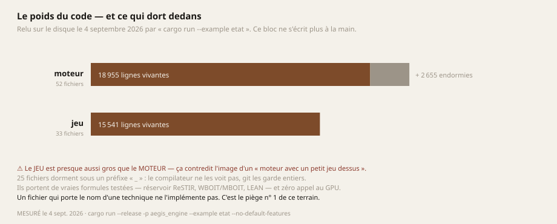

# 01 — La position : où en est réellement ce moteur

> **Tous les chiffres de cette page ont été relevés le 4 septembre 2026**, sur la branche `master`,
> sur une NVIDIA GeForce RTX 4070 SUPER sous NixOS. Chacun porte la commande qui le rejoue.
>
> ⚠ **Aucun de ces chiffres ne vient de la machine cible.** Voir [02 — Le budget](02-BUDGET.md).

---

## 1. Le compte, et pourquoi il ne s'écrit plus à la main

```bash
cargo run --release -p aegis_engine --example etat --no-default-features
```

| | |
|---|---|
| **Moteur** | **18 955 lignes vivantes**, 52 fichiers · **2 655 lignes endormies**, 25 fichiers |
| **Jeu** (banc de validation) | **15 541 lignes**, 33 fichiers |
| **Tests** | **122** côté moteur, **139** côté jeu — zéro échec |
| **Shaders réellement compilés** | **11** : `background`, `party_2d5`, `ombre`, `composition`, `halo_extraction`, `halo_descente`, `halo_montee`, `occlusion`, `copie`, `refraction`, `cartes` |
| **Ce que le moteur exige d'une carte** | **Vulkan 1.3**, et **une seule** fonctionnalité : `dynamic_rendering` |



> **Ce bloc était écrit en prose jusqu'au 3 septembre 2026, et il mentait.** Il portait « 13 337
> lignes, 85 tests, 2 228 endormies » ; trois jours plus tard les trois chiffres étaient faux, et
> rien ne le disait. *Une affirmation vérifiable n'a rien à faire dans de la prose : elle s'y périme
> en silence, avec l'autorité d'une note qu'on croit vérifiée.*

### ⚠ Le jeu est presque aussi gros que le moteur

Ce n'est pas une curiosité. Ça contredit l'image spontanée d'un « moteur avec un petit jeu dessus »,
et **ça explique pourquoi les deux se sont longtemps mélangés dans les documents**. La frontière
entre eux n'est pas une convention de rangement : elle est tenue par un test, et le détail de ce
qu'elle protège est dans [07 — La méthode](07-METHODE.md).

### La sonde qui dit ce que personne n'appelle — et qui s'accuse elle-même

`examples/etat` cherche les modules qu'aucun code n'appelle : la famille de défauts n° 1 de ce
projet est **du code complet, correct, et branché à rien**. Sa sortie du jour :

```
CE QUE PERSONNE N'APPELLE (sonde approximative — voir sa doc)
    cartes
  Calibrage : 0/2 orphelins connus retrouvés · 5/5 modules vivants correctement innocentés.
  ⚠⚠ LA SONDE EST FAUSSE — ne pas croire la liste ci-dessus.
     elle ne voit plus : ["epaisseur", "verre"]
```

**La sonde annonce elle-même qu'elle est fausse, et c'est délibéré.** Elle porte un calibrage : deux
orphelins connus d'avance qu'elle doit retrouver. Elle n'en retrouve aucun ce jour-là → elle le dit,
au lieu de rendre une liste plausible. *Une sonde qui ne sait pas dire quand elle échoue est pire
qu'une absence de sonde : elle produit une réponse crédible et fausse.*

---

## 2. Ce que le moteur sait faire, avec son coût mesuré

*Nature : **MESURÉ** par `chrono_gpu.rs` (requêtes `VkQueryPool` / `TIMESTAMP`), sur la machine de
développement — **jamais** sur la machine cible.*

| Brique | Ce que c'est exactement | Coût |
|---|---|---|
| Lumière directe | `GpuLight` lu par un shader : directionnel / ponctuel / projecteur, Lambert + GGX | inclus ci-dessous |
| Ombres | carte 2048², échantillonneur de comparaison, PCF 4 taps | **0,226 ms** |
| Chaîne HDR | la scène écrit de la **lumière** ; la courbe de tonalité s'applique **une seule fois**, en composition | — |
| Halo | 6 octaves, filtre dual ARM | **0,31 ms** |
| Occlusion ambiante | 12 directions, normale reconstruite depuis la seule profondeur, zéro image intermédiaire | **0,27 ms** |
| MSAA 4× | attachement **transitoire**, en allocation paresseuse | ≈ 0 |
| Instanciation | 3 458 appels de dessin ramenés à **52** | — |
| Réfraction | Snell aux deux interfaces, Newton en espace écran, Fresnel exact, Beer-Lambert inhomogène | *non mesuré en ms* |
| **Total d'une image** | | **≈ 1,04 ms** |

Rejouer : lancer le jeu, taper `gpu` dans sa console (puis `gpu image`, `gpu zero`).

> ### ⚠⚠ Une sonde qui ment, et il faut la connaître avant de citer ces chiffres
>
> Sous un compositeur Wayland, une fenêtre masquée cesse d'être invitée à dessiner. **Le piège n'est
> pas le gel — c'est que les durées GONFLENT d'un facteur 3 à 4** : entre deux images très espacées,
> le GPU redescend ses horloges et vide ses caches, chaque image repart à froid.
>
> | état de la fenêtre | images en 6 s | coût moyen mesuré |
> |---|---|---|
> | visible | 996 (165 im/s) | **0,222 ms** |
> | masquée | 8 (≈ 1 im/s) | **0,655 ms** |
>
> Une mesure prise fenêtre masquée ferait donc « optimiser » un code qui n'a aucun problème. Une
> garde est posée : la cadence est rendue en tête de chaque relevé, et sous 20 im/s un témoin
> s'affiche.

### ⚠ Le pire cas vaut jusqu'à dix fois la moyenne, et la cause n'est pas expliquée

0,215 ms de moyenne pour **0,554 ms** de pic sur une campagne de 971 images ; jusqu'à **2,4 ms** sur
une autre. *Sur une machine à échéance dure comme un casque, c'est le pire cas qui décide, pas la
moyenne.* La cause n'est pas connue — et il ne faut pas en inventer une.

---

## 3. Ce que le moteur NE sait PAS faire

*C'est la liste qui compte. Elle est écrite pour qu'aucun lecteur ne croie disposer d'une base qu'il
n'a pas.*

| Manque | Conséquence directe |
|---|---|
| **Aucune lumière indirecte** | Les parois ne se renvoient rien. L'ambiante hémisphérique est un **pis-aller assumé** : le jour où l'indirect existe, elle disparaît — elle ne se raffine pas |
| **Aucun volumétrique** | Pas de rai de lumière dans l'air, pas de brouillard |
| **Aucune profondeur atmosphérique** | Les plans lointains ne s'éclaircissent ni ne se désaturent |
| **Aucune transparence triée** | Les particules se mélangent en ordre de dessin |
| **Aucune dispersion** | Pas de franges colorées au bord d'un prisme ou d'une bille |
| **UNE SEULE carte d'ombre** | Donc une seule lumière ombrante |
| **⚠⚠ AUCUN SUPPORT VR** | Pas d'OpenXR, pas de rendu stéréo, pas de portage Android, pas de CI capable de produire un `.apk`. **Rien n'est commencé** |
| **Aucune CI** | Rien ne rejoue les tests automatiquement, et le rendu est précisément ce qui casse en silence |
| **Le chargeur glTF ne lit que `meshes[0].primitives[0]`** | Une vraie scène Blender à plusieurs objets perd tout sauf son premier morceau, **en silence**. Pas de matériaux, pas de hiérarchie de nœuds, donc **aucune transformation d'objet** |
| **Le banc ne voit qu'une machine** | Tous les pourcentages de budget mobile sont **calculés**, jamais mesurés |

---

## 4. Les briques qui dorment — et pourquoi elles ne sont pas supprimées

**25 fichiers** portent un préfixe `_` : le compilateur ne les voit pas, git les garde entiers.

Ce n'est pas du ménage cosmétique. Le moteur portait les noms des techniques les plus avancées du
rendu temps réel — `restir_pass.rs`, `visibility_pass.rs` (façon Nanite), `gaussian_pass.rs`,
`bindless.rs`, `oit_pass.rs`. **Aucune ne tournait**, parce que le graphe de rendu qui devait les
orchestrer n'était instancié nulle part.

> **Le coût n'était pas en calcul, il était en vérité.** Un lecteur qui ouvre le dossier `render/`
> et voit `restir_pass.rs` coche ReSTIR.

⚠ **Et le piège dans le piège :** la première conclusion écrite ici était *« elles ne calculent
rien »*, et une suppression allait suivre. **C'était faux.** Sous la plomberie vivaient des formules
justes et testées :

| Fichier endormi | Ce qu'il contient réellement |
|---|---|
| `_object_space_shading.rs` | **Anti-crénelage spéculaire LEAN** — convertit la variance des normales mip-mappées en rugosité GGX, ce qui tue le scintillement **sans TAA** |
| `_restir_pt.rs` | Mise à jour stochastique d'un réservoir + jacobien de reconnexion |
| `_oit_pass.rs` | Poids **WBOIT** et moments **MBOIT** (transparence sans tri) |
| `_compute_pipeline.rs` | Création de pipeline de calcul + calcul du nombre de groupes |
| `_scene_graph.rs` | Hiérarchie de nœuds, matrices locale et monde |
| `_voxel.rs` | 427 lignes, 7 tests, une voxelisation en **coquille** qui fait tomber tous les objets sur la même trame |

*Une passe correctement câblée à qui manque un seul appel est plus trompeuse qu'une passe vide :
elle a l'air finie.*

**Règle qui en découle, et elle est opposable :** rallumer une brique impose de **l'appeler dans le
même commit**. Une brique rallumée sans être exercée recrée exactement le défaut qu'on vient de
corriger, cette fois sans l'excuse de ne pas savoir.

---

## 5. L'écart, mesuré contre un étalon physique

Le seul instrument honnête pour dire « où en est ce moteur » n'est pas un compteur de tests : c'est
une liste de **phénomènes physiques** qu'une image de matière demande, et le compte de ceux que le
moteur exprime réellement.


**Sept sur dix-huit.** Le 31 août 2026 il en exprimait **trois** — et c'étaient les trois derniers :
la diffusion parasite de l'objectif, la compression de dynamique, l'intégration sur le photosite.
*Le moteur savait simuler une caméra qui regarde ; il ne savait rien de ce qu'elle regarde.*

Les quatre conquis depuis sont tous du côté de la matière : Fresnel exact, la réfraction à deux
interfaces, la réflexion totale interne, l'absorption le long d'un trajet inhomogène. Leur
démonstration est dans [03 — La matière](03-MATIERE.md).

> ### ⚠⚠ Et le chiffre ment si l'on s'arrête là
> **Aucun des quatre n'est dans une image du jeu.** Ils vivent dans une passe exercée par ses seuls
> tests. Le chaînon qui manque est la passe qui rastérise un maillage complet dans les deux cartes
> de géométrie — c'est écrit, ce n'est pas branché à une scène.
>
> *Écrire ces lignes en vert serait commettre exactement la famille de défauts que la section 4
> décrit.*

---

## 6. Les cinq pièges de ce terrain

*Ils ont tous coûté au moins une fois. Ils sont ici parce qu'aucun ne se signale.*

### 1. Un fichier qui porte le nom d'une technique ne l'implémente pas
Voir la section 4. Et sa forme la plus fine n'est pas un fichier mais **un commentaire** : un shader
endormi porte l'annotation « dispersion chromatique de Cauchy » au-dessus de **trois constantes
tirées à l'œil**. Aucun $n(\lambda) = A + B/\lambda^2$ nulle part. *Compter la dispersion comme « à
réveiller » au lieu de « à écrire » fait sous-estimer un chantier entier.*

### 2. Un test unitaire de rendu prouve la convention, jamais le rendu
Le HUD est sorti à l'envers avec onze tests au vert : le compilateur de shaders retourne l'axe Y, et
rien dans le code ne le disait. **La seule sonde qui tranche est une capture.**

Et son corollaire : *une garde « le décor de fond ne remonte pas vers le plan de jeu » ($z < -5$)
passait, et l'œil disait non — parce que ce qui fait reculer un décor est la **taille apparente**,
pas la profondeur.* **Quand un test vert contredit un œil sur du rendu perçu, c'est le test qui a
tort** : il mesure une grandeur voisine de celle qui compte.

### 3. Une somme de corrections justes ne franchit pas un mécanisme absent
Une journée entière de corrections toutes justes, mesurées et validées une à une n'a pas approché la
cible visuelle — parce que celle-ci reposait sur **cinq mécanismes que le moteur ne possède pas**.
*Rien ne clignote quand chaque étape passe.* **Quand plusieurs corrections justes n'améliorent pas
le ressenti, cesser de corriger et se demander ce qui manque au niveau en dessous.**

### 4. Un test GPU peut tomber sans qu'aucune vérification n'échoue
La suite plantait **une fois sur quatre**, par `SIGSEGV`, **après** que les 116 tests aient affiché
`ok` — donc sans coupable nommé. Cause : trois tests ouvraient chacun leur contexte, créant trois
instances Vulkan dans un même processus, **ce que le moteur ne fait jamais**. Le pilote décharge sa
bibliothèque à la mort de la dernière instance, et tout thread qui se termine ensuite saute dans du
code démappé.

| Condition | Crashs |
|---|---|
| Témoin | **5 / 20** |
| Variable de repli du loader Vulkan *(sonde de confirmation)* | **0 / 20** |
| **Après correctif** | **0 / 40** |

*Le défaut vivait dans l'écart entre ce que le banc fait et ce que le moteur fait.* **Devant un
plantage intermittent, mesurer un TAUX avant de conclure quoi que ce soit** — et savoir que
`cargo test … | tail` rend « exit code 0 » sur une exécution qui plante, parce que `$?` lit le code
de `tail`.

### 5. Un banc qui balaie une ligne ne mesure pas une image
Le banc de réfraction balayait **une ligne** d'écran et annonçait 1,8° d'erreur pour l'approximation
classique. L'image, elle, montrait le monde entièrement replié. **Le vrai chiffre est 36,4° — vingt
fois pire.** L'équateur est le cas le plus favorable de toute l'image.

*Quand une image et un banc ne s'accordent pas, c'est que le banc mesure autre chose que ce qu'on
croit.*

---

## 7. Ce qui a changé récemment, et ce que ça a révélé

### Le moteur peut enfin se vérifier lui-même (2-3 septembre 2026)

> **Avant cette date, le moteur n'avait AUCUN test qui regarde un pixel produit par la carte
> graphique. Zéro, depuis toujours.** Les tests vérifiaient des conventions et des calculs faits par
> le processeur ; les images de preuve du dépôt sortaient d'un rastériseur écrit à la main, **pas de
> Vulkan**.

*C'est la raison structurelle pour laquelle « le rendu casse en silence » sur ce projet — ce n'est
pas une négligence, c'est une architecture.*

Le remède existait déjà, écrit, complet, documenté avec soin, et **appelé par rien depuis sa
naissance** : un contexte Vulkan sans fenêtre. Dix minutes de lecture contre le chantier qu'on
s'apprêtait à ouvrir. **Et le jour où la fonction a enfin tourné, elle a rendu trois défauts** — un
`SIGABRT` dans un destructeur qui détruisait sans condition une chaîne de présentation absente, une
fuite mémoire qu'aucun avertissement ne pouvait dire, et une déclaration « Vulkan 1.4 » que le
moteur n'utilisait nulle part.

> **Un mécanisme jamais exercé ne cache pas un défaut : il en cache trois.**

### La géométrie importée était éclairée de travers depuis des mois

Le chargeur glTF ne lisait **que les positions**. La normale valait `position.normalize_or_zero()` —
exact sur une sphère centrée à l'origine, faux partout ailleurs. Or c'est la normale qui entre dans
Lambert, GGX et les ombres.

| Modèle | Écart moyen entre la normale du fichier et celle qu'on inventait |
|---|---|
| `cannon_turret.glb` | 69,6° |
| `spike_trap.glb` | 64,4° |
| **`map.glb`** | **88,3°** |
| `rockbasdroit.glb` | 50,5° |

**88°, c'est perpendiculaire : aucune corrélation.** Ce défaut a survécu à 221 tests verts, à une
lumière PBR complète, à un halo, à une occlusion ambiante et à une campagne de mesure GPU — **parce
que la scène est faite de cubes générés en code, qui ont leurs normales ailleurs.** La géométrie
importée n'avait jamais été le sujet, donc personne n'avait regardé.

> **Il faut supposer que tout ce qui touche à la 3D « vraie » est dans le même état tant que ça n'a
> pas été regardé de près** : matériaux, hiérarchie de nœuds, transformations, multi-primitives.

**Et une garde écrite pour ce correctif était CREUSE, démasquée par la mutation.** Le test du
décalage d'accesseur était bâti sur les modèles du dépôt ; en réintroduisant le défaut, **il restait
vert**. Mesure faite ensuite : *aucun* des dix modèles n'a de décalage d'accesseur, *aucun* ne
partage une vue de tampon. **Le cas n'existait pas dans nos fichiers, donc aucun test bâti sur eux
ne pouvait mordre.** Remplacé par un `.glb` **fabriqué dans le test**.

---

## 8. Une portabilité numérique prouvée, et sa limite

Le moteur tourne sur ARM64 (un Motorola G54, sans NDK). Les images produites par les tests,
comparées par empreinte SHA-256 entre x86_64 et ARM64 : **14 sur 15 identiques octet pour octet**.
La quinzième diffère d'**un seul niveau de canal sur 786 432**, et seulement dans sa version
intégrée en 48 pas — la même en 4 pas est identique.

*C'est l'**accumulation** qui sépare les architectures, jamais le calcul.*

> **Et une garde contre-intuitive en sort : ne jamais graver l'empreinte d'une image dans une
> assertion.** Un tel test passerait ici et tomberait chez quelqu'un d'autre, en accusant un code
> juste. **La reproductibilité au bit près entre architectures n'est pas une propriété qu'on a le
> droit d'exiger.**

⚠ **Ce téléphone ne mesure aucune milliseconde GPU**, et pas faute d'essayer : Android interdit au
terminal d'y charger le pilote du GPU. Tout ce qui y a tourné l'a été sur son **processeur**.

---

## Ce que cette page autorise à conclure

- Le moteur **calcule juste** ce qu'il calcule, et on sait le prouver contre des vérités analytiques.
- Il **calcule très peu** de ce qu'une image de matière demande — sept phénomènes sur dix-huit, dont
  aucun des quatre récents n'atteint encore une image de jeu.
- **Aucun chiffre de performance ne vient de la machine cible**, et il n'en viendra jamais : voir
  [02 — Le budget](02-BUDGET.md).
- Il ne bat **aucun record**, et il n'a **rien inventé** au niveau algorithmique. Ce qui est déjà
  original est ailleurs : [07 — La méthode](07-METHODE.md).
