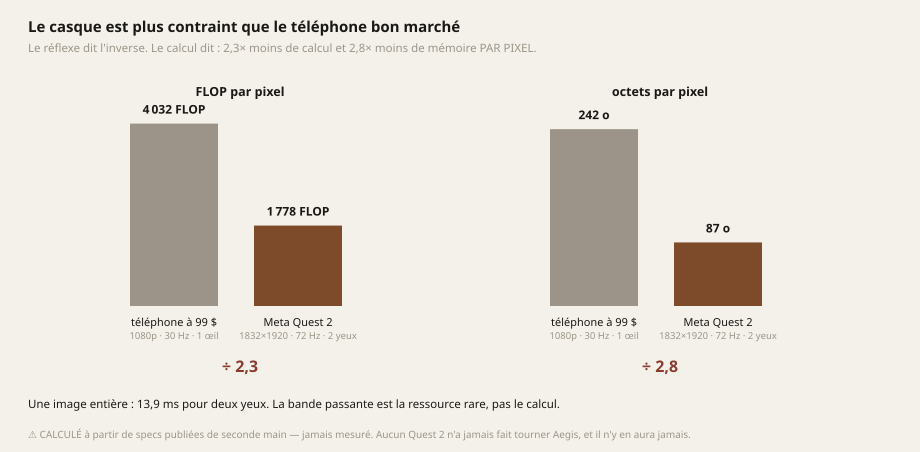
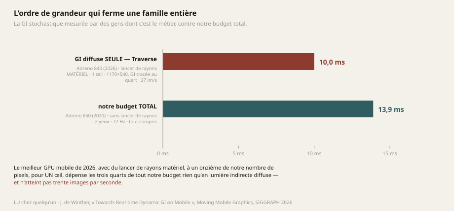
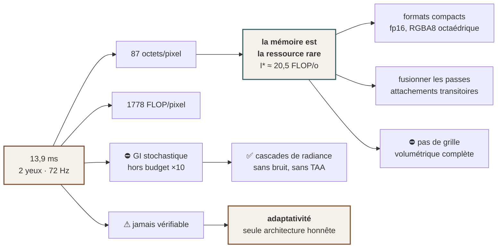

# 02 — Le budget : la seule contrainte dure du projet est physique

> **Un moteur qui vise le temps réel n'a qu'une contrainte qui ne se négocie pas : le temps.** Tout
> le reste — la qualité, la richesse, l'élégance — se paie dedans. Cette page dérive ce budget,
> montre ce qu'il élimine avant qu'on n'écrive une ligne, et dit pourquoi il ne sera **jamais**
> vérifié.

---

## 1. La dérivation

Un casque à échéance dure impose une durée d'image fixe. Pour le Meta Quest 2 :

$$T_{\text{image}} = \frac{1}{f} = \frac{1}{72\ \text{Hz}} = 13{,}9\ \text{ms}$$

Ce n'est pas une moyenne à tenir : **c'est une échéance.** Rater une image sur un écran plat produit
une saccade ; la rater dans un casque produit un malaise physique, parce que l'image cesse de suivre
la tête. La grandeur qui décide est donc le **pire cas**, pas la moyenne — et le moteur mesure
aujourd'hui un pire cas qui vaut **jusqu'à dix fois sa moyenne**, sans que la cause soit expliquée.

Le travail à produire dans cette fenêtre :

$$P = 2 \cdot w \cdot h \cdot f = 2 \times 1832 \times 1920 \times 72 \approx 5{,}06 \times 10^{8}\ \text{pixels/s}$$

Le facteur 2 est celui qu'on oublie : **deux yeux**. Et il ne se rattrape pas en baissant la
résolution, parce que la résolution est ce que le casque impose.

De là, les deux grandeurs qui gouvernent réellement les choix d'architecture — le calcul et la
mémoire, **rapportés au pixel** :

$$\Phi = \frac{C_{\max}}{P} \qquad\qquad B = \frac{M_{\max}}{P}$$

avec, pour l'Adreno 650 du Quest 2, $C_{\max} \approx 900$ GFLOP/s et $M_{\max} \approx 44$ Go/s.

$$\Phi \approx 1778\ \text{FLOP/pixel} \qquad\qquad B \approx 87\ \text{octets/pixel}$$

> ⚠ **`CALCULÉ`.** Ces deux chiffres de machine sont des **specs publiées reprises de seconde main**,
> que personne dans ce projet n'a vérifiées. Ce qu'ils autorisent est écrit en §4.

---

## 2. Le résultat contre-intuitif : le casque est plus dur que le téléphone à 99 \$

Le réflexe dit que le pire cas est le vieux téléphone. **C'est faux.**



| | calcul (GFLOP/s) | mémoire (Go/s) | pixels/s | FLOP/pixel | octets/pixel |
|---|---|---|---|---|---|
| téléphone à 99 \$, 1080p, 30 Hz, 1 œil | 250 | 15 | $6{,}2\times10^{7}$ | **4032** | **242** |
| **Meta Quest 2**, 72 Hz, 2 yeux | 900 | ~44 | $5{,}06\times10^{8}$ | **1778** | **87** |

**Le Quest 2 a un GPU 3,6 fois plus gros et un travail 8,2 fois plus gros.** Il dispose donc de
**2,3× moins de calcul** et **2,8× moins de bande passante** par pixel que le téléphone bon marché.

*Sources : Adreno 610 et 830 = chiffres donnés par HypeHype à SIGGRAPH 2025 (`LU`). Adreno 650 =
spec publiée, non vérifiée.*

---

## 3. ⭐ Ce que le budget décide vraiment : la mémoire, pas le calcul

Le chiffre de 87 octets par pixel est celui qui commande, et voici pourquoi — sous une forme qui se
démontre plutôt qu'elle ne se déclare.

Le modèle *roofline* rapporte le débit atteignable à l'**intensité arithmétique** d'un traitement,
c'est-à-dire son nombre d'opérations par octet transféré :

$$I = \frac{\phi}{r + w}$$

où $\phi$ est le nombre d'opérations flottantes par pixel, $r$ les octets lus et $w$ les octets
écrits. Une passe est limitée par la mémoire — et non par le calcul — dès que

$$I < I^{*} = \frac{C_{\max}}{M_{\max}} \approx \frac{900}{44} \approx 20{,}5\ \text{FLOP/octet}$$

**Or presque toute passe de rendu moderne se situe très en dessous de ce seuil.** Une composition qui
lit deux cibles en `RGBA16F` (16 octets), écrit 8 octets et dépense une trentaine d'opérations :

$$I = \frac{30}{16 + 8} = 1{,}25 \quad \Longrightarrow \quad \frac{I^{*}}{I} \approx 16$$

Elle est **limitée par la bande passante d'un facteur seize**. Ajouter du calcul y est presque
gratuit ; ajouter une lecture y coûte plein tarif.

> ### Trois conséquences opposables, et elles gouvernent tout le reste du dossier
>
> 1. **Le format d'une cible est une décision d'architecture, pas un détail.** Passer une carte de
>    `RGBA16F` à `RGBA8` avec normale octaédrique **double** la surface d'écran qu'on peut se
>    permettre de traiter, à budget constant — voir [03 — La matière](03-MATIERE.md) §5.
> 2. **Une passe supplémentaire coûte structurellement plus qu'un calcul supplémentaire.** Fusionner
>    deux passes économise 45 % des octets lus et 56 % des octets écrits (chiffre d'Arm, `LU`),
>    parce qu'un G-buffer intermédiaire n'atteint jamais la mémoire principale.
> 3. **Le MSAA est quasi gratuit, et ce n'est pas une chance.** En attachement **transitoire**, en
>    allocation paresseuse, avec `storeOp = DONT_CARE`, les échantillons vivent et meurent dans la
>    mémoire de tuile : $r + w \approx 0$ hors de la puce. *C'est déjà ce que fait ce moteur.* En
>    revanche `vkCmdResolveImage` ajoute ~3 ms en forçant un aller-retour en mémoire — le même
>    résultat visuel, pour un coût qui tient tout seul un cinquième du budget.

### ⚠ Et un point de terrain qui interdit une généralisation courante

L'Adreno du Quest 2 **n'est pas un tuileur pur**. Les trois familles se placent sur un continuum :
Xclipse penche vers le rendu immédiat, **Adreno est un hybride à binning avec de la mémoire dédiée,
capable de basculer entre les deux modes**, Mali est le tuileur différé classique. *Écrire « le
Quest 2 est un GPU à tuiles » et en déduire des optimisations pensées pour Mali serait une erreur de
terrain.*

---

## 4. ⚠⚠ Ce budget ne sera JAMAIS vérifié, et ça change l'architecture

**Il n'y aura jamais de Meta Quest 2 sous la main dans ce projet.** Ce n'est pas un contretemps qu'on
refermera : c'est une contrainte permanente.

Quatre conséquences, et la troisième est la plus lourde :

**1. Le budget de 13,9 ms restera `CALCULÉ` pour toujours.** Il repose sur des specs que personne n'a
vérifiées et que personne ne vérifiera.

**2. Un tel budget garde toute sa valeur pour ÉLIMINER une famille de techniques.** Il n'en a
**aucune** pour en valider une. **On s'en sert pour dire « ça ne tient clairement pas », jamais pour
dire « ça tient ».**

**3. « Coller à la limite physique » devient inatteignable par la mesure préalable.** On ne peut pas
mesurer la limite d'une machine qu'on n'aura jamais. *Chercher le bord d'un budget calculé de
seconde main, c'est optimiser contre un chiffre imaginaire.* → **L'adaptativité cesse d'être une
préférence pour devenir la seule architecture honnête** : voir
[06 — L'adaptativité](06-ADAPTATIVITE.md).

**4. Le moteur doit DIRE lui-même ce qui lui manque chez celui qui tient la machine.** C'est ce que
fait `core::capacites` : il refuse en nommant la capacité absente *et* son chemin de repli. *Sur une
machine qu'on ne verra jamais, un message d'erreur est le seul instrument de mesure dont on
disposera.*

```
Vulkan 1.3 — cette carte annonce 1.2. Le moteur n'utilise qu'une seule fonctionnalite
de la 1.3 (`dynamicRendering`), disponible en extension `VK_KHR_dynamic_rendering`
des la 1.2 : la descente est une extension a demander, pas une reecriture.
```

### Le corollaire, appliqué : ne demander que ce dont on se sert

Le moteur exigeait **quatre** fonctionnalités Vulkan et n'en utilisait **qu'une**. Les trois autres
étaient entrées par un commit de *gameplay* ; personne ne les avait demandées, personne ne s'en
servait, **et elles refusaient des machines pour rien**.

| Exigée avant | Utilisée par du code vivant ? |
|---|---|
| `dynamicRendering` | ✅ |
| `synchronization2` | ❌ zéro barrière de ce type hors des fichiers endormis |
| `bufferDeviceAddress` | ❌ aucun usage, nulle part |
| `descriptorIndexing` | ❌ seulement dans un fichier endormi, donc non compilé |

Et la spécification tranche sur laquelle des trois était vraiment dangereuse : sur un appareil qui
annonce 1.3, les deux premières sont **obligatoires** — les demander ne pouvait pas échouer.
`descriptorIndexing`, lui, n'est obligatoire que si son extension est supportée : **c'était la seule
capable de faire échouer la création du périphérique sur une machine 1.3 parfaitement valide, et
c'était celle qui ne servait à rien.**

> **Un test le garde désormais :** `le_moteur_ne_demande_que_ce_qu_il_utilise` échoue si le moteur
> réclame quoi que ce soit dont aucun code vivant ne se sert. *La règle n'est pas écrite, elle est
> inatteignable.*

---

## 5. ⭐⭐ Ce que ce budget ferme — et c'est un ordre de grandeur, pas une marge

C'est ici que le budget cesse d'être une comptabilité pour devenir un instrument de décision.

Une équipe dont les bancs de mesure sont le métier a porté sur mobile la pile de lumière indirecte la
plus avancée qui existe — **ReSTIR GI + clipmap d'irradiance, sur lancer de rayons matériel** — et
l'a mesurée.



| | |
|---|---|
| Résolution de rendu | **1170 × 540**, GI tracée au **quart** (292 × 135) |
| Coût du système de GI **diffuse seule** | **≈ 10 ms** |
| Sur | **Adreno 840** — le meilleur GPU mobile de 2026 |
| Yeux | **un seul** |
| Cadence obtenue | *« imaginez ça tourner à un stable 27 images/s »* |
| Leur propre conclusion | *« avec la **prochaine génération** de mobiles, on pourrait **peut-être** faire tourner ReSTIR GI sur mobile **avec un certain succès** »* |

*`LU` — J. de Winther, Traverse Research, « Towards Real-time Dynamic GI on Mobile », Moving Mobile
Graphics, SIGGRAPH 2026.*

**Mettons les deux côtés côte à côte :**

| | leur mesure | notre budget |
|---|---|---|
| GPU | Adreno 840 (2026) | Adreno 650 (2020) |
| Lancer de rayons | **matériel** | **aucun** |
| Yeux | 1 | **2** |
| Pixels | $6{,}3\times10^{5}$ | $7{,}0\times10^{6}$ — **onze fois plus** |
| Temps | 10 ms **pour la GI diffuse seule** | 13,9 ms **pour tout** |

> ### Le verdict, et il n'est plus un raisonnement
> La famille ReSTIR / path tracing / GI stochastique est **hors budget par un ordre de grandeur**
> pour cette machine. Ce n'est pas une prudence de notre part : c'est la mesure de gens dont c'est
> le métier, publiée cette année, **sur du matériel six ans plus récent et deux fois moins chargé**.

**Et ce que ça ouvre**, c'est l'argument le plus fort en faveur des cascades de radiance : elles sont
**sans bruit, donc sans débruiteur, donc sans anti-crénelage temporel** — voir
[04 — La lumière indirecte](04-LUMIERE.md).

---

## 6. Le second couperet : le débruitage temporel et la VR ne s'entendent pas

L'éclairage moderne à coût fixe fonctionne en tirant **peu** d'échantillons — donc en produisant du
bruit — puis en débruitant temporellement, presque toujours via l'anti-crénelage temporel (TAA). En
casque, ça pose trois problèmes qui ne sont pas des détails :

1. **La tête bouge en permanence** → reprojection permanente → *ghosting*, bien plus gênant en
   casque qu'à l'écran.
2. **Le casque applique déjà sa propre reprojection.** Deux couches temporelles empilées se dégradent
   l'une l'autre, et personne ne contrôle la seconde.
3. **Le TAA coûte de la bande passante** — la ressource déjà rare (§3).

Et ça heurte frontalement l'exigence centrale de ce moteur, qui est la **clarté** : un éclairage
bruité débruité temporellement est, par construction, une image *floue et instable*.

> **L'étape stochastique a donc deux raisons indépendantes de rester fermée** : une qualitative (le
> débruitage temporel incompatible avec le casque) et une chiffrée (§5). *Elle n'est pas annulée pour
> autant — elle reste la bonne réponse pour le haut de gamme, et son patron d'échantillonnage par
> tuiles à deux étages est excellent. Elle cesse simplement d'être un candidat pour la machine de
> référence.*

---

## 7. Le levier qui doublerait le budget, et pourquoi il n'est pas tranché

Le rendu à demi-cadence avec synthèse d'images par le casque (*Application SpaceWarp*) fait passer le
budget de 13,9 ms à **≈ 27,8 ms**. C'est, de loin, le levier le plus puissant de tout ce dossier.

⚠ **Mais c'est une reprojection temporelle** — exactement la famille contre laquelle §6 met en garde.
La différence est réelle et il faut la tenir : elle est appliquée **par le casque, sur l'image finie,
avec les vecteurs de mouvement et la profondeur qu'on lui fournit**. Ce n'est pas un débruiteur qui
reconstruit un signal bruité. *Empiler notre propre TAA par-dessus resterait interdit ; s'appuyer sur
celle-là ne l'est pas.*

**Ce point n'est pas tranché** → [08 — Ce qui est ouvert](08-OUVERT.md).

Et deux extensions ne sont pas optionnelles pour y aller, dont **aucune n'existe ici** :

| Extension | Pourquoi |
|---|---|
| `VK_KHR_multiview` | Un appel de dessin rendu N fois pour N vues. **Prérequis** de SpaceWarp et du *late latching*. Exige des images en tableaux 2D pour couleur, profondeur et résolution |
| `VK_EXT_fragment_density_map` | Le rendu fovéal fixe — texture de densité à 1/32 de la résolution |

---

## 8. Ce que le budget impose au reste du dossier



| Ce que le budget dit | Où c'est instruit |
|---|---|
| La mémoire commande les formats et le nombre de passes | [03 — La matière](03-MATIERE.md) §5 |
| Le stochastique est éliminé, les cascades restent | [04 — La lumière indirecte](04-LUMIERE.md) |
| Un budget non vérifiable impose de choisir à l'exécution | [06 — L'adaptativité](06-ADAPTATIVITE.md) |
| SpaceWarp, multiview, fovéation : non tranchés | [08 — Ce qui est ouvert](08-OUVERT.md) |

---

## ⚠ Les inconnues de cette page, nommées

1. **Les chiffres du Quest 2** (~900 GFLOPS, ~44 Go/s) sont des specs de seconde main. Tout le
   budget en dépend.
2. **La résolution de rendu réelle en VR est inconnue** — les casques rendent souvent en dessous de
   la résolution du panneau, avec de la fovéation. Notre calcul est donc **pessimiste**, ce qui est
   sain pour un budget mais fausse toute comparaison si on l'oublie.
3. **Le budget est calculé pour un GPU froid.** Le mobile bride fort et vite : l'appareil de l'étude
   citée en §5 s'est fait brider **à mi-parcours de son propre banc**. Quand un fondeur optimise avec
   un studio, son premier geste est de **verrouiller les fréquences à un niveau tenable
   indéfiniment** et d'optimiser contre ça. **Notre budget est donc encore optimiste**, et notre banc
   mesure une machine froide — c'est-à-dire une machine qui n'existe pas.
4. **Aucun Quest 2 n'a jamais fait tourner Aegis**, et il n'y en aura jamais.
