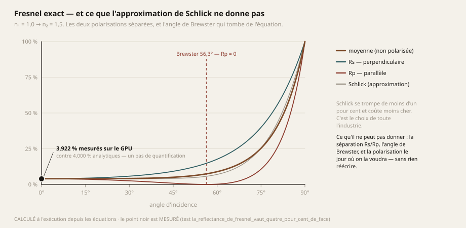
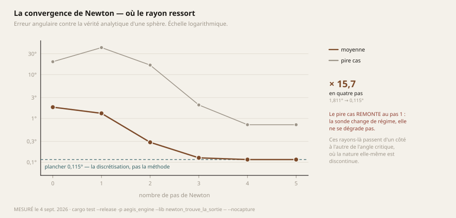
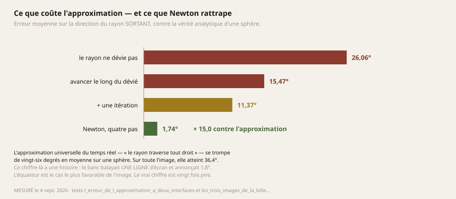
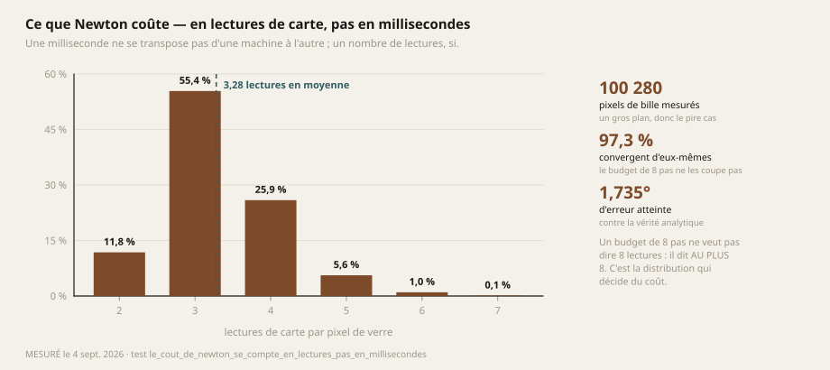
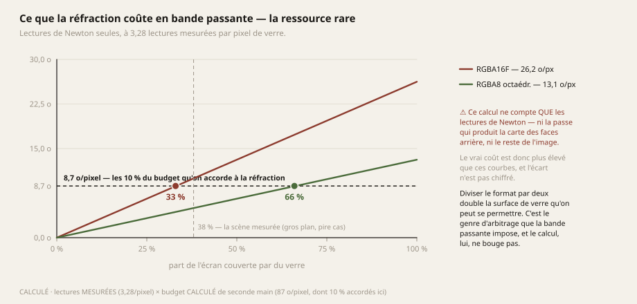
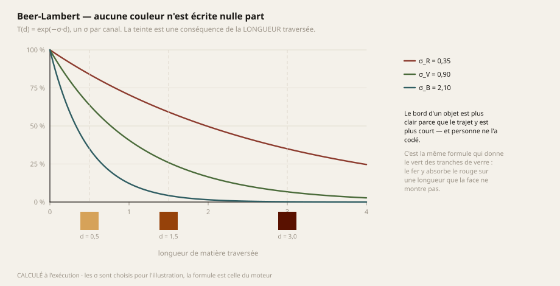
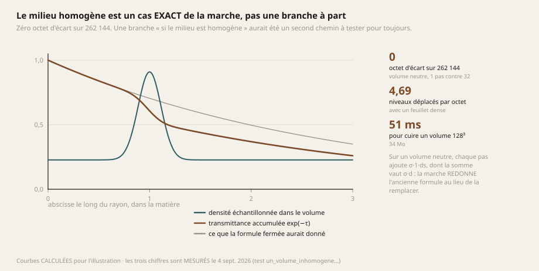
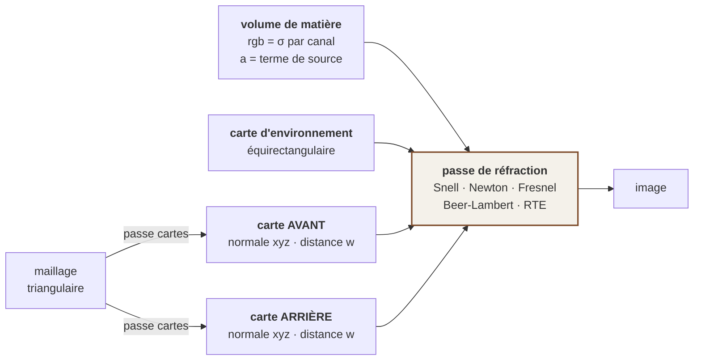
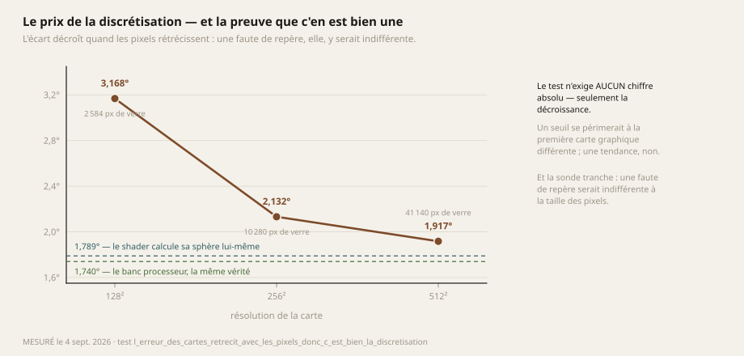
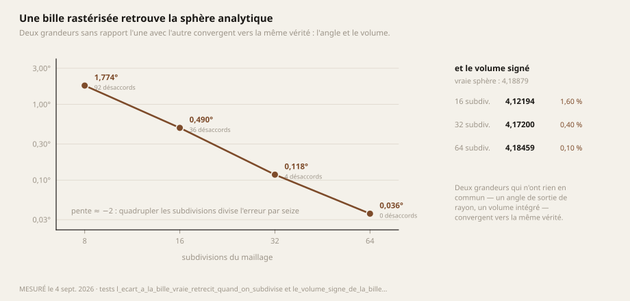

# 03 — La matière : ce qui est fait, et comment on le démontre

> **C'est la seule page de ce dossier où le moteur a quelque chose à montrer.** Tout y est mesuré
> contre une **vérité analytique** — jamais contre une autre de nos implémentations, jamais contre
> une capture d'écran de référence.
>
> ⚠ Et tout y est également **absent des images du jeu** : ces mécanismes vivent dans une passe
> exercée par ses seuls tests. Le chaînon manquant est nommé en §7.

---

## 1. Le constat qui a ouvert le chantier

Toute l'infographie temps réel repose sur une hypothèse rarement discutée :

> **La matière est une surface infiniment mince, décrite par une fonction de réflexion.**

C'est faux, et c'est la raison pour laquelle les images sont en plastique. Regardez un fruit à
contre-jour : on voit sa peau, puis sa chair par transparence sur les bords, puis les filaments à
l'intérieur. **Rien de ce qu'on décrit là n'est une propriété de surface.**

Ce n'est pas non plus mille paramètres. C'est **une** grandeur :

> ### La longueur de matière que la lumière a traversée — et de quoi cette longueur est faite.

Le bord qui devient transparent, la chair qui apparaît, la couleur qui vire au rouge, le vert des
tranches d'une plaque de verre : tout cela en découle. **Un moteur qui sait manipuler des longueurs
et des directions plutôt que des coefficients est au bon endroit pour ce rendu.**

Cette page dit ce qui est écrit, et le prouve.

---

## 2. Snell, et la réflexion totale qui n'est pas un cas à coder

Sous forme vectorielle, avec $\mathbf{i}$ la direction incidente normalisée, $\mathbf{n}$ la normale
sortante, et $\eta = n_1/n_2$ :

$$\cos\theta_i = -\,\mathbf{n}\cdot\mathbf{i}
\qquad
k = 1 - \eta^2\left(1 - \cos^2\theta_i\right)$$

$$\mathbf{t} = \eta\,\mathbf{i} + \left(\eta\cos\theta_i - \sqrt{k}\,\right)\mathbf{n}$$

⭐ **Tout le mécanisme tient dans le signe de $k$.** Quand $k < 0$, la racine n'existe pas : il n'y a
pas de rayon transmis. **La réflexion totale interne n'est donc pas un cas particulier à écrire —
c'est ce qui reste quand l'équation n'a pas de solution.**

L'angle critique en découle sans être écrit nulle part :

$$k = 0 \iff \sin\theta_i = \frac{1}{\eta} = \frac{n_2}{n_1}
\qquad\Longrightarrow\qquad
\theta_c = \arcsin\!\left(\frac{n_2}{n_1}\right)$$

Pour du verre ($n_1 = 1{,}5$, $n_2 = 1$), $\theta_c = 41{,}81°$.

> **`MESURÉ` : 41,82°**, contre 41,81° de théorie.
> ```bash
> nix-shell shell.nix --run "cargo test --release -p aegis_engine --lib l_angle_critique -- --nocapture"
> ```

**Pourquoi ça compte plus qu'une élégance de façade.** Un `if angle > 41.81` aurait été une constante
arbitraire à justifier pour toujours — et **fausse dès le premier matériau différent**. Ici, changer
l'indice change l'angle critique sans qu'une ligne bouge. *C'est la forme la plus stricte du principe
qui gouverne ce moteur : une constante qui se dérive vaut mieux qu'une constante qui se règle, et une
constante qui disparaît vaut mieux que les deux.*

---

## 3. Fresnel exact — et ce que Schlick ne peut pas donner

### Les équations

Avec $c_i = \cos\theta_i$, $c_t = \cos\theta_t = \sqrt{1 - \eta^2(1-c_i^2)}$ :

$$r_s = \frac{\eta\,c_i - c_t}{\eta\,c_i + c_t}
\qquad\qquad
r_p = \frac{\eta\,c_t - c_i}{\eta\,c_t + c_i}$$

$$R(\theta_i) = \tfrac{1}{2}\left(r_s^2 + r_p^2\right)$$

Le facteur $\tfrac12$ suppose une lumière **non polarisée** : les deux composantes à parts égales.
*C'est à cet endroit précis, et nulle part ailleurs, qu'une pondération de polarisation viendra se
placer — sans qu'aucune formule soit réécrite.*



### Ce qui tombe des équations sans être écrit

$$\boxed{\;R_0 = R(0) = \left(\frac{n_1-n_2}{n_1+n_2}\right)^2 = 0{,}04\;}
\qquad
\boxed{\;\theta_B = \arctan\!\left(\frac{n_2}{n_1}\right) = 56{,}31°\;}$$

À l'angle de Brewster, $r_p$ s'annule : la lumière réfléchie y est **totalement polarisée**. Personne
ne l'a codé — comme l'angle critique, il tombe de l'équation.

### La mesure, contre une vérité qui n'est pas la nôtre

`MESURÉ` — la valeur de $4{,}00\ \%$ à incidence normale est dans tous les manuels d'optique. Elle
est **indépendante de ce moteur** : c'est ce qui rend la mesure probante, parce qu'elle ne compare
pas deux de nos calculs entre eux.

| | |
|---|---|
| Réflectance au centre de la bille | **3,922 %** mesurés contre **4,000 %** analytiques |
| Écart | **un pas de quantification** sur 8 bits |
| Courbe entière, 56 distances du centre au bord | **aucun** écart au-delà de ce que la discrétisation explique |

```bash
nix-shell shell.nix --run "cargo test --release -p aegis_engine --lib la_reflectance_de_fresnel -- --nocapture"
```

### Pourquoi les exactes plutôt que Schlick

$$R_{\text{Schlick}}(\theta) = R_0 + (1-R_0)\,(1-\cos\theta)^5$$

Schlick coûte une puissance cinquième au lieu d'une racine carrée, et se trompe de moins d'un pour
cent. **C'est le choix de toute l'industrie, et il serait défendable.** Les exactes donnent trois
choses que l'approximation ne donne pas :

1. **Elles se démontrent au lieu de se régler.** Il n'y a plus aucune constante.
2. **Elles séparent les deux polarisations.** Ce que ce code moyenne aujourd'hui, il pourra le
   pondérer demain — sans rien réécrire.
3. **Elles donnent Brewster gratuitement.**

> ⚠ **Et un critère de test qui était faux, corrigé plutôt que desserré.** La première version
> exigeait que la réflectance dépasse 50 % au bord de la bille ; elle plafonne à **43 %**. Entre
> l'avant-dernier pixel et le dernier, **l'angle saute de 78° à 85°** : le centre du dernier pixel ne
> voit jamais le rasant. *Exiger d'un banc une borne qu'il ne peut pas échantillonner, c'est
> extrapoler au-delà de ce que l'instrument atteint.* Remplacé par la **courbe entière**, avec une
> tolérance qui n'est pas un réglage : l'amplitude réelle de la réflectance **à l'intérieur** du
> pixel.

### ⚠ Ce que la part réfléchie ne fait pas

Elle **ne traverse rien** : ni absorbée, ni colorée par le milieu. C'est ce qui garde un reflet
**blanc** sur une bille bleue — et ce qui rend un reflet reconnaissable. *Le multiplier par
l'absorption donnerait un reflet bleu : plausible, et faux.*

---

## 4. Le problème dur : où le rayon ressort

### Pourquoi c'est difficile

Une fois dévié à l'entrée, le rayon **ne va plus vers le pixel qu'on calcule** : il part de travers.
Il faut donc trouver où il perce la face arrière, alors qu'on ne connaît cette face qu'à travers une
carte indexée **par l'écran**.

Autrement dit : chercher la racine de

$$g(s) = d\Big(\pi\big(\mathbf{p} + s\,\mathbf{d}\big)\Big) \;-\; s$$

où $\mathbf{p}$ est le point d'entrée, $\mathbf{d}$ la direction dans la matière, $\pi$ la projection
monde → écran, et $d(\cdot)$ la distance lue dans la carte des faces arrière.

### ⭐⭐ Le cadeau géométrique : la dérivée se LIT, elle ne s'estime pas

Newton exige $g'$. **Le gradient de cette fonction est la normale de la surface** — elle est déjà
dans la carte, à côté de la distance, sans une seule lecture supplémentaire. Le pas se réécrit alors
comme l'intersection du rayon avec le **plan tangent** au point courant :

$$s_{k+1} \;=\; \frac{\big(\mathbf{q}_k - \mathbf{p}\big)\cdot \mathbf{n}_k}{\mathbf{d}\cdot \mathbf{n}_k}$$

avec $\mathbf{q}_k$ le point de surface reconstruit au pas $k$ et $\mathbf{n}_k$ sa normale lue.

**Convergence quadratique, une lecture de carte par tour :**

$$\lvert e_{k+1}\rvert \;\le\; C\,\lvert e_k\rvert^{2}$$

### La mesure



| pas | erreur moyenne | pire cas |
|---|---|---|
| 0 | 1,811° | 19,790° |
| 1 | 1,309° | 41,634° |
| 2 | 0,285° | 16,566° |
| 3 | 0,126° | 2,035° |
| **4** | **0,115°** | **0,719°** |
| 5 | 0,115° | 0,719° |

**× 15,7 en quatre pas**, puis un plancher. Ce plancher n'est pas une limite de la méthode : c'est
la **discrétisation** de la carte.

⚠ **Le pire cas REMONTE au pas 1**, et ce n'est pas une dégradation : ces rayons-là passent d'un côté
à l'autre de l'angle critique, **où la nature elle-même est discontinue**. Un rayon qui cesse de
sortir pour être totalement réfléchi change de régime ; aucune méthode numérique ne peut être
continue là. *C'est aussi ce phénomène qui fait briller les tranches d'une plaque de verre.*

Le banc le vérifie plutôt que de le supposer : le pixel du pire écart est à **0,002° de l'angle
critique**.

### ⚠⚠ La lecture finale n'est pas un détail

Sans une relecture de la carte **après** le dernier pas, la normale rendue est celle d'**avant** :
Newton corrige la position sans que la normale suive — or c'est la normale, pas la position, qui
entre dans Snell à la sortie.

> **Mesuré : « zéro pas » et « un pas » donnaient exactement le même angle, au millième près.** Le
> mécanisme avait l'air de tourner et ne servait à rien. *C'est la famille de défauts n° 1 de ce
> projet, sous sa forme la plus fine : pas du code mort, mais du code vivant dont le résultat est
> jeté.*

### Ce que l'approximation classique coûte vraiment



| Méthode | Erreur moyenne sur la direction sortante |
|---|---|
| Le rayon ne dévie pas *(l'approximation universelle du temps réel)* | **26,06°** |
| Avancer le long du rayon dévié | 15,47° |
| + une itération | 11,37° |
| **Newton, 4 pas** | **1,74°** |

Sur toute l'image, l'approximation atteint **36,4°** — voir le piège n° 5 de
[01 — La position](01-POSITION.md) §6.

---

## 5. Le coût réel

⭐ **Ce coût est compté en LECTURES DE CARTE, pas en millisecondes.** Une milliseconde mesurée sur une
RTX 4070 ne dit rien de ce que ça coûtera sur un Adreno de 2020 ; un nombre de lectures, si.



| | |
|---|---|
| Pixels de bille mesurés | **100 280** (gros plan = pire cas) |
| Convergence spontanée | **97,3 %** — le budget de 8 pas ne les coupe pas |
| Erreur atteinte | **1,735°** |
| **Lectures par pixel** | **3,28 en moyenne** |

*Un budget de 8 pas ne veut pas dire 8 lectures : il dit **au plus** 8. C'est la distribution réelle
qui décide du coût.*

### Ce que ça donne en bande passante



En s'accordant **10 % du budget** ([02 — Le budget](02-BUDGET.md)) pour cette seule fonction, soit
8,7 octets par pixel d'écran :

| Format des cartes | Par pixel de verre | Part d'écran tenable en verre |
|---|---|---|
| distance + normale en `RGBA16F` | 26,2 o | **33 %** |
| `RGBA8`, normale octaédrique | 13,1 o | **66 %** |

> **Diviser le format par deux double la surface de verre qu'on peut se permettre.** C'est
> exactement le genre d'arbitrage que la bande passante impose — et le calcul, lui, ne bouge pas.

⚠ **Ce calcul ne compte QUE les lectures de Newton.** Ni la passe qui produit la carte des faces
arrière, ni le reste de l'image. **Le vrai coût est donc plus élevé, et l'écart n'est pas chiffré.**

---

## 6. L'absorption : une seule formule, dont le milieu homogène est un cas exact

### L'équation

La loi de Beer-Lambert donne ce qui survit d'un rayon après une longueur de matière :

$$T = e^{-\sigma d}$$

Avec un $\sigma$ **par canal**, la teinte naît de l'écart entre trois nombres. *Aucune couleur n'est
écrite nulle part.*



Mais un $\sigma$ unique pour tout le trajet ne décrit qu'un verre teinté. Une matière réelle change
le long du rayon — un feuillet de colorant mal mélangé, des bulles d'air. **Aucune formule fermée ne
dit ça.** Il faut accumuler l'épaisseur optique :

$$\tau(a,b) \;=\; \int_a^b \sigma\big(\mathbf{p} + u\,\mathbf{d}\big)\,du$$

Et la matière ne fait pas que retirer de la lumière : **elle en rend**. C'est l'équation du transfert
radiatif, dans sa forme la plus simple — absorption plus émission, sans diffusion multiple :

$$\boxed{\;L \;=\; L_{\text{fond}}\;e^{-\tau(0,D)} \;+\; \int_0^{D} L_e(t)\;e^{-\tau(0,t)}\;dt\;}$$

⚠ **L'atténuation appliquée à la lumière rendue est celle du chemin DÉJÀ PARCOURU**, pas de
l'épaisseur totale : ce qu'un point renvoie doit remonter jusqu'à la surface d'entrée. *Confondre les
deux donne une image plus sombre au centre qu'au bord — ce qui ressemble à un défaut d'éclairage et
n'en est pas un.*

*Sans le terme de source, une bulle d'air dans du sucre serait un trou noir, jamais un reflet.*

### ⭐⭐ Et il n'y a PAS deux chemins de code

Discrétisation au **point milieu**, avec $\Delta s = D/N$ :

$$\tau_k \;=\; \sum_{j<k} \sigma\!\left(t_{j+\frac12}\right)\Delta s
\qquad\qquad
L \;\approx\; L_{\text{fond}}\,e^{-\tau_N} \;+\; \sum_{k=0}^{N-1} L_e\!\left(t_{k+\frac12}\right)e^{-\tau_{k+\frac12}}\,\Delta s$$

Sur un volume **neutre**, $\sigma$ est constant et chaque pas ajoute $\sigma\,\Delta s$, dont la
somme vaut exactement $\sigma D$ :

$$\sum_{j<N} \sigma\,\Delta s \;=\; \sigma\,N\,\frac{D}{N} \;=\; \sigma D$$

> **La marche REDONNE l'ancienne formule au lieu de la remplacer.** Une branche « si le milieu est
> homogène » aurait été un second chemin à tester pour toujours, et le premier à diverger.



**`MESURÉ` :**

| | |
|---|---|
| Formule fermée (1 pas) contre marche (32 pas, volume uniforme $16^3$) | **0 octet différent sur 262 144**, écart maximal **0** niveau sur 255 |
| Un feuillet dense d'un côté | déplace **4,69 niveaux** par octet en moyenne |
| Un terme de source (des bulles) | gain moyen **1,24** niveau, maximal **97**, **0 pixel assombri** |

⭐ **La garde du test n'est pas « l'image change » mais « aucun pixel ne s'assombrit ».** Ajouter de
la lumière ne peut, physiquement, que rendre l'image plus claire. *« C'est différent » aurait laissé
passer un terme branché à l'envers.*

⚠ **L'échantillon se prend au MILIEU de chaque segment, jamais à son début** : sur un feuillet mince,
prendre le bord fait manquer ou compter deux fois une couche entière selon le pas — et l'erreur ne se
voit pas, elle se contente de décaler la teinte.

### ⚠⚠ Le mur que ce chantier a révélé — structurel, pas anecdotique

**Un volume cuit ne peut pas porter des inclusions fines.** Une sphère cesse de scintiller à partir
de huit échantillons dans son diamètre. Pour des bulles de rayon 0,016 à 0,046 dans une bille de
rayon 1 :

| Volume | Mémoire | Une bulle fine y mesure |
|---|---|---|
| $128^3$ | 34 Mo | **0,9 texel** |
| $256^3$ | **268 Mo** | 1,7 texel |
| $\approx 1200^3$ | $\approx$ **27 Go** | 8 texels — *ce qu'il faudrait* |

**C'est une propriété du choix d'architecture, pas un défaut d'implémentation :** une grille
régulière paie **partout** la finesse dont elle n'a besoin **que par endroits**. Le banc processeur
n'a pas ce problème parce qu'il n'a aucune grille — *il demande au point s'il est dans une bulle, et
la réponse est exacte à n'importe quelle échelle.*

Les pistes connues — volume creux, détail procédural par-dessus une structure grossière, inclusions
instanciées — **ne sont pas instruites** → [08 — Ce qui est ouvert](08-OUVERT.md).

---

## 7. La géométrie entre par deux cartes, et par elles seules



Le shader de réfraction **ne connaît aucune forme**. Il lit deux images — une normale et une distance
par pixel — et tout ce qu'il calcule en découle. **Que ces cartes viennent d'une intersection
analytique, d'un rastériseur logiciel ou d'une passe GPU sur un maillage venu de Blender, pas une
ligne d'ici ne change.**

### Pourquoi c'était délibéré, et ce que ça a permis de mesurer

Le shader a d'abord calculé **sa propre sphère**, analytiquement. Ce n'était pas un raccourci : *une
carte exacte ISOLE l'erreur.*

| | erreur moyenne à la vérité analytique |
|---|---|
| sans Newton (0 tour) | **16,761°** |
| via cartes exactes $256^2$, Newton 6 tours | **2,132°** |
| calcul direct, sans passer par des cartes | **1,789°** |
| banc processeur, même vérité, autre machine | **1,740°** |
| **bille réellement rastérisée** → réfraction | **2,158°** |

**Deux chiffres séparés valent mieux qu'un chiffre global.** Le passage par des cartes coûte 0,34° —
et il aurait été facile de l'écrire comme un fait. C'était une **hypothèse** : rien ne disait que ça
venait des pixels plutôt que d'une faute d'indexation.

### La sonde qui tranche

> *Si le surcoût vient de la taille des pixels, il doit rétrécir quand les pixels rétrécissent ; une
> erreur de repère, elle, est indifférente à la résolution.*



| Résolution | Écart | Pixels de verre |
|---|---|---|
| $128^2$ | **3,168°** | 2 584 |
| $256^2$ | **2,132°** | 10 280 |
| $512^2$ | **1,917°** | 41 140 |

**Décroissance monotone vers 1,789°.** Le test n'exige **aucun chiffre absolu**, seulement la
décroissance : *un seuil se périmerait à la première carte graphique différente, une tendance non.*

### ⚠ On ne compare JAMAIS le GPU au processeur

Deux implémentations issues du même raisonnement peuvent être fausses **exactement de la même
façon**, et leur accord ne prouverait que leur parenté. *Chacune est confrontée séparément à une
sphère dont on sait calculer analytiquement où le rayon ressort.*

### ⭐ Et la géométrie rastérisée retrouve la sphère vraie



| Subdivisions | Écart angulaire | Volume signé | Désaccords de silhouette |
|---|---|---|---|
| 8 | 1,774° | — | 92 |
| 16 | 0,490° | 4,12194 | 36 |
| 32 | 0,118° | 4,17200 | 4 |
| **64** | **0,036°** | **4,18459** | **0** |

La vraie sphère de rayon 1 a pour volume $\tfrac{4}{3}\pi = 4{,}18879$. **Deux grandeurs qui n'ont
rien en commun — un angle de sortie de rayon et un volume intégré — convergent vers la même vérité**,
et l'erreur angulaire suit une pente de $-2$ en échelle logarithmique : quadrupler les subdivisions
divise l'erreur par seize.

### ⚠ Les deux cartes sont lues SANS interpolation, et c'est une décision

Interpoler deux normales de part et d'autre d'une silhouette fabriquerait une normale **qui n'existe
sur aucune surface** — et cette normale-là entrerait ensuite dans Snell, où elle dévierait un rayon
vers nulle part. *Le lissage est un défaut ici.*

Le volume de matière, lui, **est** interpolé : entre deux texels de matière, la valeur intermédiaire
décrit un milieu qui existe. Et la carte d'environnement a **son propre** échantillonneur, parce que
l'azimut doit **boucler** là où un volume se fige à son bord. *Un seul échantillonneur partagé aurait
posé une couture derrière la caméra — un défaut qu'on aurait ensuite attribué à la géométrie.*

---

## 8. L'épaisseur traversée, sans lancer un seul rayon

C'est le banc de vérité contre lequel le GPU se mesure, et son idée mérite d'être dite.

### L'objection qui a écarté la solution évidente

La réponse évidente serait de faire entrer un rayon dans le maillage et de compter ses traversées.
**Elle est mortelle** : là où les triangles convergent — aux pôles d'une sphère, dans un losange vu
de côté — ils deviennent des échardes d'aire quasi nulle, et un test d'intersection y est instable au
dernier bit près. Or **une seule traversée ratée ou comptée deux fois INVERSE le résultat** : dedans
devient dehors, et l'objet se troue exactement à son pôle.

### La somme signée : le problème n'est pas résolu, il n'a plus de lieu où exister

On rastérise. Chaque face **avant** retranche sa distance à la caméra ; chaque face **arrière**
ajoute la sienne :

$$e(x,y) \;=\; \sum_{f\,\in\,\mathcal{F}^{-}(x,y)} d_f \;-\; \sum_{f\,\in\,\mathcal{F}^{+}(x,y)} d_f$$

Sur un maillage fermé, la somme par pixel vaut **exactement** la longueur de matière traversée par le
rayon de ce pixel.

```
   caméra ──────►  ╭─────────╮
                   │         │     −d₁ (entrée)  +d₂ (sortie)  =  d₂ − d₁
                   ╰─────────╯
```

**Trois propriétés en découlent, et ce sont elles la réponse à l'objection :**

1. **Aucune intersection n'est calculée**, donc aucune n'est instable. Les échardes peuvent
   converger tant qu'elles veulent : elles ne couvrent aucun centre de pixel, et n'entrent donc dans
   aucune somme.
2. **La règle de remplissage rend le procédé étanche.** Un pixel dont le centre tombe exactement sur
   une arête partagée est attribué à **un seul** des deux triangles — sinon il serait compté deux fois
   du même côté, et l'épaisseur serait fausse d'une distance entière. *C'est la seule chose subtile
   du procédé, et c'est elle qui porte la garantie.*
3. ⭐ **Ça marche sur les objets NON convexes, sans un mot de plus.** Une main aux doigts écartés donne
   $-d_1 + d_2 - d_3 + d_4$, soit la somme des segments de chair. *On n'a rien fait pour ; ça tombe de
   la signature.*

**`MESURÉ` :** aucune épaisseur négative ni supérieure au diamètre · le bord de la silhouette est
infiniment mince · deux objets alignés donnent la somme de leurs épaisseurs · les pôles où tous les
triangles convergent **ne trouent pas l'objet** · deux triangles qui partagent une arête ne comptent
le pixel qu'une fois.

---

## 9. ⛔ Ce que tout ceci ne fait PAS

*Nommé pour qu'aucun lecteur ne coche plus que ce qui est là.*

| Limite | Nature |
|---|---|
| **Une seule couche de matière par pixel** — une face avant, une face arrière | **Limite du MODÈLE.** Un objet creux, ou deux verres l'un derrière l'autre, demandent plus de deux cartes. Se lève par une liste chaînée par pixel : un chantier à part entière |
| **Le terme de source est SCALAIRE** — la lumière rendue est neutre | Il n'y avait qu'un canal libre. Une matière qui **rougeoie** demandera un second volume |
| **Aucune dispersion** — pas de franges colorées | À **écrire**, pas à réveiller : le fichier endormi qui porte ce nom contient trois constantes tirées à l'œil, aucun $n(\lambda)$ |
| **Aucune diffusion** — pas de verre dépoli | Et c'est le point le plus fin : le flou d'un dépoli croît avec la distance **objet ↔ face diffusante**, pas avec la distance à la caméra. *Aucune approximation par « rugosité » ne produit ça* |
| **Aucune caustique** | Suppose du lancer de rayons matériel — hors budget |
| **Aucune polarisation** | La porte est ouverte ($r_s$ et $r_p$ sont séparés), mais personne au monde ne le fait en temps réel |
| **Les constantes poussées sont au plafond** : 128 octets, la garantie Vulkan, au ras | Le prochain vecteur devra reprendre un champ libre ou passer par un tampon uniforme |
| **⚠⚠ Rien de tout ceci n'est dans une image du JEU** | Le chaînon manquant est la passe qui rastérise une **scène** complète dans les deux cartes. La passe existe pour un maillage ; la scène, non |

### Et une dette de format, notée sans être fermée

Le volume est en `R32G32B32A32_SFLOAT`, dont **le filtrage linéaire n'est pas garanti par Vulkan**. Il
l'est sur la carte de développement, vérifié en interrogeant le pilote. *Sur un mobile, ce format
peut ne pas être filtrable : le passage en 16 bits demandera une conversion écrite à la main, donc
prouvée par un test.*

---

## Ce que cette page autorise à conclure

- La physique de la matière écrite ici est **exacte au sens strict** : elle se démontre, elle se
  mesure contre des vérités analytiques indépendantes de nous, et ses constantes ont **disparu** au
  lieu d'être réglées.
- Elle couvre **quatre** des dix-huit phénomènes de l'étalon.
- Son coût est chiffré **en lectures**, ce qui se transpose ; il n'est **pas** chiffré en
  millisecondes sur la machine cible, ce qui ne se transpose pas.
- **Rien de tout ça n'atteint encore une image de jeu**, et c'est la limite qui compte le plus.
