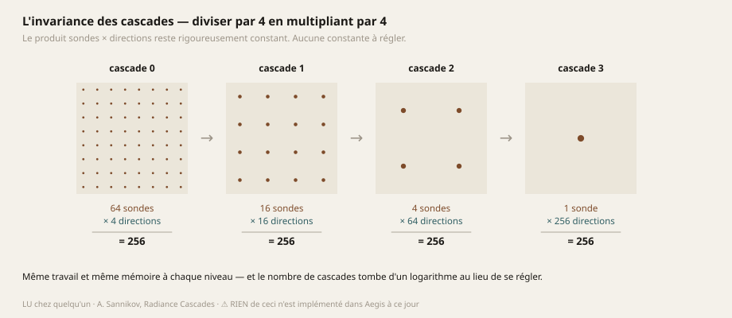
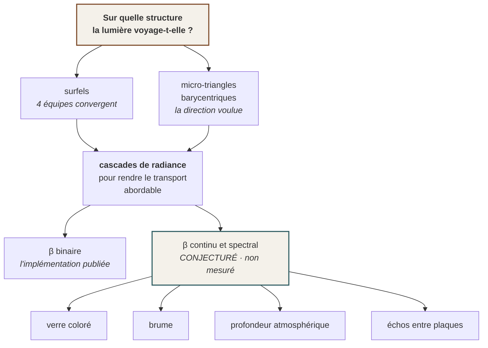

# 04 — La lumière indirecte : le problème ouvert n° 1

> **C'est le chantier qui décide de tout le reste.** Il commande la texture, l'ombrage stéréo, le
> découplage temporel et la géométrie — d'un seul coup. Et c'est la seule page de ce dossier où
> **rien n'est implémenté** : tout y est `LU`, `CALCULÉ` ou `CONJECTURÉ`.

---

## 1. Le problème, posé proprement

L'équation du rendu (Kajiya, 1986) :

$$L_o(\mathbf{x},\omega_o) \;=\; L_e(\mathbf{x},\omega_o) \;+\; \int_{\Omega^{+}} f_r(\mathbf{x},\omega_i,\omega_o)\; L_i(\mathbf{x},\omega_i)\;(\omega_i\cdot\mathbf{n})\;d\omega_i$$

Sa difficulté tient en une ligne : $L_i(\mathbf{x},\omega_i)$ est le $L_o$ d'un **autre point**. C'est
une équation intégrale de Fredholm de seconde espèce, et le rendu temps réel consiste entièrement à
en approcher la solution sous une échéance.

### Ce que le moteur fait aujourd'hui

$$L_i(\omega) \;\approx\; \mathrm{lerp}\!\left(c_{\text{sol}},\; c_{\text{ciel}},\; \frac{\omega_y + 1}{2}\right)$$

C'est l'intégrale analytique d'un ciel bicolore sur l'hémisphère. Elle a une qualité réelle — **aucune
constante à régler** : la largeur de l'horizon, la courbe du dégradé et la teinte auraient chacune été
un chiffre arbitraire, et il n'y en a aucun. La même fonction répond aux deux questions du moteur :
*« qu'est-ce qui éclaire cette surface ? »* (on lui passe la normale) et *« qu'y a-t-il derrière, là
où rien n'est dessiné ? »* (on lui passe la direction du regard). **Ils ne peuvent plus se
contredire, non pas parce qu'on les a réglés pareil, mais parce que c'est le même calcul.**

**Et elle ignore totalement la scène.** Une face tournée vers le haut reçoit autant de ciel au fond
d'un trou qu'en plein air. C'est un **pis-aller assumé** : le jour où l'indirect existe, elle
disparaît — elle ne se raffine pas.

*(L'occlusion ambiante corrige partiellement ce défaut : 12 directions, normale reconstruite depuis
la seule profondeur, 0,27 ms. Elle mesure la part du ciel qu'un point voit réellement. C'est le seul
terme qui fait qu'un objet **touche** le sol — mais ce n'est pas de la lumière indirecte : elle
retire, elle n'apporte jamais.)*

---

## 2. ⭐ Le fait qu'on ne dit jamais assez fort

> **On n'éclaire jamais la géométrie de rendu. On éclaire une SECONDE représentation du monde,
> construite pour la lumière.**

C'est vrai de **toutes** les méthodes, sans exception :

| Méthode | Sa seconde représentation |
|---|---|
| Lumen | champs de distance par maillage + cache de surface |
| DDGI | sondes en grille |
| SDFGI | cascade de champs de distance signés |
| *Split Radiance Cascades* | sondes 3D dans une table de hachage creuse + une BVH |
| *Love and Deepspace* | **surfels** pré-générés par asset |
| Voxel cone tracing | cascade de voxels |

**Donc la question « comment fait-on une lumière qui bouge et qui interagit » se réduit à une seule
décision, et c'est LE choix de socle :**

> ### 🔺 Sur quelle structure la lumière voyage-t-elle ?

---

## 3. Les cinq familles, jugées contre nos critères

Deux critères éliminatoires, posés avant d'examiner quoi que ce soit — ils viennent du sommet de la
pyramide (des personnages animés, en triangles, en casque) et non des techniques :

- **⛔ supporte la géométrie qui BOUGE** — aucune décision de socle ne doit supposer une scène statique ;
- **⛔ n'exige AUCUN dépliage UV** — un personnage importé, généré ou déformé n'en a pas forcément un
  de bonne qualité, et le dépliage est justement le point faible historique du tout-triangle.

| Représentation | Ce que c'est | Bouge ? | UV ? | Verdict |
|---|---|---|---|---|
| **Espace écran** (SSILVB…) | On éclaire ce qu'on voit | ✅ | ✅ aucun | ⛔ **aveugle au hors-champ.** Excellent en *complément*, jamais en socle |
| **Voxels** (VCT, SVO) | Discrétise le **volume** | 🟡 revoxeliser coûte | ✅ aucun | ⛔ mémoire cubique, et ça grave le voxel dans le moteur |
| **Champs de distance** (Lumen, SDFGI) | Distance à la surface la plus proche | 🟡 un SDF par objet, recalculé | ✅ aucun | 🟡 Godot documente lui-même SDFGI comme *« l'une des techniques les plus exigeantes »* de son moteur |
| **BVH de triangles** (ray query) | La géométrie exacte | ⛔ reconstruire la BVH quand ça bouge coûte deux fois | ✅ aucun | ⛔ **8,6 à 11,5 ms sur une RTX 3080 pour un œil** |
| ⭐ **Surfels** | Discrétise la **SURFACE** en disques orientés | ✅ y compris les personnages skinnés | ✅ aucun | ⭐ le seul qui passe les deux critères sans réserve |

### ⚠ Et Lumen ne s'applique pas, Epic l'écrit noir sur blanc

> *« Lumen ne supporte pas la VR ; les hautes fréquences et résolutions exigées par la VR en font un
> mauvais candidat. »*

C'est un **fait**, pas une opinion — et il rappelle qu'il existe bel et bien des techniques qui n'ont
aucune version « en plus petit ».

### La convergence de quatre équipes indépendantes

| Qui | Ce qu'ils en disent |
|---|---|
| **EA SEED — GIBS** (SIGGRAPH 2021, affiné 2024) | *« aucune précomputation, aucun maillage spécial, aucun jeu d'UV spécial »* · gère **objets dynamiques, personnages SKINNÉS et transparence** · *« environnements de taille arbitraire, avec performance et empreinte mémoire prévisibles »* · ⭐ explicitement pensé pour le **contenu créé par les utilisateurs** |
| ***Love and Deepspace*** (GDC 2026) | **Surfels + cascades de radiance 3D, EN PRODUCTION SUR MOBILE**, lancer de rayons **logiciel** sur des surfels pré-générés par asset |
| **SurfelPlus** (SIGGRAPH 2025) | *« une solution de GI par surfels optimisée pour le matériel graphique bas de gamme »* |
| **Sannikov** (Split RC) | Cite les surfels comme l'une des trois façons de ne stocker la radiance **que près des surfaces** |

> **Lire la colonne de droite en entier, c'est lire notre cahier des charges.** *« Aucun UV spécial »*
> répond à l'obstacle n° 1 du tout-triangle. *« Personnages skinnés »* répond au sommet de la
> pyramide. *« Contenu créé par les utilisateurs »* répond au cap. *« Matériel bas de gamme »* répond
> au budget. **Aucune de ces quatre équipes ne visait notre problème, et les quatre ont convergé.**

Et l'élégance est réelle, au sens strict : un voxel discrétise le **volume** — un coût en $N^3$ pour
une information qui ne vit que sur une pellicule ; un surfel discrétise la **surface** — un coût en
$N^2$. *La lumière diffuse ne vit que sur les surfaces, donc le volume est un excédent, littéralement.*

---

## 4. ⚖ Le carrefour que ce dossier ne tranche pas : triangle ou surfel

**La direction du projet écarte les surfels** : *« innover dans le rendu 3D par TRIANGLE et pas par
SURFEL »*. Le corpus interne, lui, concluait l'inverse deux semaines plus tôt, sur les quatre
convergences ci-dessus. **Voici l'arbitrage honnête, dans les deux sens.**

### Ce qu'il faut dire d'abord, parce que c'est un malentendu fréquent

**Un surfel n'est pas une façon de représenter la géométrie.** La géométrie reste triangulaire dans
tous les cas, y compris chez EA SEED. Un surfel est une structure **auxiliaire** où la lumière
indirecte est stockée et propagée. Le débat n'est donc pas « triangles contre surfels » mais :

> **La radiance doit-elle vivre sur la surface elle-même, ou sur un nuage échantillonné qui la
> recouvre ?**

### Pourquoi quatre équipes ont choisi le nuage

Un triangle est un **mauvais support pour de la radiance**, et pour trois raisons cumulatives :

1. **Sa taille varie de mille à un dans une scène réelle.** Le même budget d'échantillons donnerait
   une densité de radiance absurde sur un mur et famélique sur une poignée de porte.
2. **Il n'a pas de paramétrisation uniforme** partagée avec ses voisins.
3. **Une scène qui bouge le déforme.**

### ⭐ Ce qui donne malgré tout du poids à la voie triangulaire — et ce n'est pas un principe

La coordonnée barycentrique **est déjà une paramétrisation intrinsèque du triangle** :

$$\mathbf{p}(u,v) \;=\; (1-u-v)\,\mathbf{a} \;+\; u\,\mathbf{b} \;+\; v\,\mathbf{c},
\qquad u,v \ge 0,\; u+v \le 1$$

Elle ne demande **aucun dépliage**, elle est continue à travers le maillage, et deux industries s'en
servent déjà : les **micro-maillages barycentriques** de NVIDIA (déplacement compressé jusqu'à
**0,5 bit par micro-triangle**) et **Htex** (texture par demi-arête, pour topologies arbitraires).

**Le problème n° 1 ci-dessus — l'uniformité — se résout en subdivisant adaptativement chaque triangle
jusqu'à une aire cible :**

$$k(T) \;=\; \left\lceil \log_2 \sqrt{\frac{A(T)}{A^{*}}} \right\rceil
\qquad\Longrightarrow\qquad
4^{k}\ \text{micro-triangles d'aire} \approx A^{*}$$

⚠ **Et là, l'objection honnête arrive : on vient de recréer une grille uniforme sur la surface,
c'est-à-dire des surfels avec plus d'étapes.** Il faut la poser franchement, sinon on se raconte une
histoire.

### ⭐⭐ Sauf qu'il reste une différence, et elle est réelle : la CONNECTIVITÉ

Un nuage de surfels n'a **aucune** topologie. Un maillage de micro-triangles hérite de celle de son
parent. Trois conséquences, et elles se chiffrent :

| | surfels | micro-triangles barycentriques |
|---|---|---|
| **Trouver les voisins d'un échantillon** | recherche spatiale : table de hachage ou grille, avec sa mémoire, ses collisions et son coût par accès | **gratuit** — c'est l'adjacence du maillage, connue à la construction |
| **Interpoler entre échantillons** | pondération par distance, avec des coutures aux frontières de densité | interpolation barycentrique, **continue par construction** |
| **Suivre une déformation** | il faut re-semer, recycler, et gérer la naissance/mort au fil du mouvement | **les micro-triangles suivent leur parent**, y compris skinné : la matrice est déjà calculée pour le rendu |
| **Mémoire par échantillon** | position + normale + rayon + radiance | **radiance seule** — la position se recalcule depuis $(u,v)$ et les trois sommets |

> **Ce dernier point n'est pas une commodité.** Sur une machine où la bande passante est rare d'un
> facteur seize ([02 — Le budget](02-BUDGET.md) §3), ne pas stocker la position ni la normale d'un
> échantillon de radiance est exactement le genre d'économie qui décide.

**`CONJECTURÉ`.** Rien de ceci n'est mesuré. La question qui décide n'est pas philosophique, elle est
chiffrable, et elle n'a pas été chiffrée :

> Combien coûte le parcours de rayons entre micro-triangles, **sans** structure d'accélération
> spatiale, comparé au parcours entre surfels **avec** ?

*Écarter les surfels par conviction sans avoir mesuré l'alternative serait exactement ce que ce
dossier interdit dans l'autre sens — choisir dans un catalogue sans poser la question que le catalogue
ne pose pas.* → [08 — Ce qui est ouvert](08-OUVERT.md).

---

## 5. Les cascades de radiance : l'idée, et sa dérivation

Quelle que soit la structure choisie en §4, il faut rendre le transport abordable. C'est ce que font
les cascades de radiance, et c'est la seule famille compatible avec le budget de ce projet — parce
qu'elle est **sans bruit, donc sans débruiteur, donc sans anti-crénelage temporel**.

### La formulation

On décompose le champ de radiance en **intervalles de distance**, du champ proche au champ lointain :

$$J_n(\mathbf{p},\omega) \;=\; \text{la radiance rencontree sur l'intervalle } t_{n-1} < t \le t_n$$
$$\beta_n(\mathbf{p},\omega) \;=\; \text{la transmittance a travers ce meme intervalle}$$

et la fusion des cascades s'écrit :

$$\boxed{\;L(\mathbf{x},\omega) \;=\; J \;+\; \beta \cdot L\big(\mathbf{x} + t_0\,\omega,\; \omega\big)\;}$$

⭐ **Cette équation est identique au compositing alpha prémultiplié**, avec $\alpha = 1 - \beta$. Le
papier le note lui-même. *Retenez-le : c'est de là que sort la §6.*

### ⭐⭐ L'invariance, et elle est triviale à démontrer

À chaque niveau, on **divise les sondes par 4** en **multipliant les directions par 4** :

$$N_n = N_0\cdot 4^{-n}
\qquad\qquad
D_n = D_0\cdot 4^{\,n}$$

$$\Longrightarrow\qquad N_n \cdot D_n \;=\; N_0 \cdot D_0 \quad \text{pour tout } n$$

**Même calcul, même mémoire à chaque cascade.** Le produit est rigoureusement constant.

### Le nombre de cascades tombe d'un logarithme

Il ne se règle pas au jugé :

$$n_{\max} \;=\; \left\lceil \log_4\!\left(\frac{\text{diagonale de la scene}}{t_0}\right)\right\rceil - 1$$

$$\text{origine}_n \;=\; t_0\,\frac{4^{\,n}-1}{3}
\qquad\qquad
\text{longueur}_n \;=\; t_0\cdot 4^{\,n}$$

*Vérification : $\text{origine}_0 = 0$, $\text{origine}_1 = t_0$, $\text{origine}_2 = 5t_0$ — chaque
intervalle commence exactement là où le précédent finit.*

> ⚠ **Ces formules viennent d'une source pédagogique, pas du papier original.** À revérifier contre
> l'original avant d'écrire une ligne de code dessus. *Le signaler coûte une phrase ; ne pas le
> signaler coûterait un chantier bâti sur une paraphrase.*

### Le facteur d'échelle : pourquoi 4 et pas 2

Deux erreurs sont en compétition à chaque cascade :

- **l'erreur angulaire** — la largeur du cône d'une direction, à la distance de l'intervalle :
  $\varepsilon_{\text{ang}} \sim t_n \cdot \Delta\omega_n$ ;
- **l'erreur spatiale** — l'espacement des sondes : $\varepsilon_{\text{spa}} \sim \Delta x_n$.

L'implémentation d'origine maintient $\varepsilon_{\text{ang}}$ **constante**. *Split Radiance
Cascades* démontre qu'il vaut mieux viser $\varepsilon_{\text{ang}} \approx \varepsilon_{\text{spa}}$,
et que ce critère conduit à $\ell = 4$ plutôt qu'à $\ell = 2$ — avec une réduction nette des
artefacts.

> ⚠ **`LU`, et la dérivation n'est PAS reproduite ici.** Elle est en annexe du papier ; je ne l'ai pas
> refaite, donc je ne la présente pas comme mienne. *Une démonstration recopiée sans être comprise est
> un argument d'autorité déguisé en mathématiques.*

**Ce qui compte pour ce projet, et qui ne dépend pas de la dérivation :** *c'est le genre de constante
qui se justifie au lieu de se régler à l'œil.* Il y a un monde entre « $\ell = 4$ parce que ça rendait
mieux » et « $\ell = 4$ parce que c'est le point où deux erreurs s'égalisent ».

---

## 6. ⭐⭐⭐ Une idée qu'on croit neuve : rendre $\beta$ continu et spectral

**`CONJECTURÉ`. Rien de ceci n'est implémenté, mesuré, ni publié à notre connaissance.**

### Le constat

Dans l'implémentation de Sannikov, **la transmittance $\beta$ est binaire** : $\beta = 0$ si un
occulteur est présent dans l'intervalle, $1$ sinon. C'est un choix d'implémentation.

> **Rien dans la formulation ne l'exige.** $\beta$ y est défini comme *la transmittance à travers
> l'intervalle* — c'est-à-dire, exactement, la grandeur que
> [03 — La matière](03-MATIERE.md) §6 calcule déjà.

### La proposition

$$\beta_n(\mathbf{p},\omega) \;=\; \exp\!\Big(-\!\!\int_{t_{n-1}}^{t_n}\!\!\sigma(\lambda,u)\,du\Big)
\qquad \lambda \in \{R,V,B\}$$

Un $\beta$ **continu** et **par canal**, où $\sigma$ est le coefficient d'extinction du milieu
réellement traversé.

### Pourquoi c'est cohérent, et pas un bricolage

La fusion **n'a pas à changer d'une ligne** : l'équation $L = J + \beta L'$ est déjà celle du
compositing prémultiplié, et un $\alpha$ par canal y est parfaitement légal. *On ne rajoute pas un
mécanisme au socle — on cesse de jeter une information que sa formulation prévoyait.*

### Ce que ça referme d'un coup

| Phénomène | Aujourd'hui | Avec un $\beta$ spectral |
|---|---|---|
| Verre coloré | une passe de réfraction séparée | **le socle** |
| Brume, brouillard | une grille volumétrique — hors budget | **le socle** |
| Profondeur atmosphérique | trois teintes fixes, imitation grossière | **le socle** |
| Échos entre plaques voisines | rien | **le socle** |

**Quatre lignes de l'étalon des dix-huit phénomènes**
([01 — La position](01-POSITION.md) §5), par une capacité qui
naît d'une structure déjà présente plutôt que d'une passe de plus.

### ⚠ Ce que ça coûte — chiffré, parce qu'une idée non chiffrée n'est pas une idée

Une entrée de cascade porte une radiance et une transmittance. En supposant la radiance en trois
canaux 16 bits :

| | $\beta$ binaire | $\beta$ RVB 8 bits | $\beta$ RVB 16 bits |
|---|---|---|---|
| bits par entrée | $48 + 1 = 49$ | $48 + 24 = 72$ | $48 + 48 = 96$ |
| rapport | ×1,00 | **×1,47** | **×1,96** |

**Sur une machine limitée par la mémoire d'un facteur seize, doubler l'empreinte d'une structure lue
à chaque fusion n'est pas anodin.** Le nombre d'entrées, lui, ne bouge pas : c'est $N_0 D_0$ par
cascade, invariant (§5).

> **Ce qu'il faudrait mesurer avant d'y croire**, et rien de tout ça ne l'est :
> 1. Le coût réel de la fusion en octets par image, aux deux formats.
> 2. Si le format 8 bits par canal suffit — la transmittance est bornée dans $[0,1]$ et se lit
>    perceptuellement, donc probablement oui, et ça ramène le surcoût à +47 %.
> 3. Si un $\beta$ **spectral seulement sur les cascades basses** (le champ proche, où la matière est
>    visible) et binaire au loin tient la ligne rouge du projet — *ce que l'adaptativité tourne, ce
>    sont des NOMBRES, jamais des algorithmes différents* ([06 — L'adaptativité](06-ADAPTATIVITE.md)).
>    Un format qui varie par cascade reste un nombre. **À l'instruire, pas à supposer.**

---

## 7. Ce qui existe ailleurs, et ce que ça vaut ici

*Rappel de la règle du projet : **pas de shader recopié.** On lit, on comprend, on écrit. Un shader
qu'on ne sait pas dériver est une boîte noire, et une boîte noire dans le chemin critique du rendu se
paiera le jour où elle sera lente sur une machine qu'on n'a pas.*

| Source | Nature | Chiffres | Verdict |
|---|---|---|---|
| **Radiance Cascades**, Sannikov | `LU` partiellement | — | Le papier fondateur. **À lire en entier avant d'écrire une ligne** |
| **Split Radiance Cascades** (arXiv 2607.20384, juil. 2026) | `LU` en entier | **8,6 ms** (Sponza) à **11,5 ms** (San Miguel) sur RTX 3080 Laptop, **un œil** | ⛔ tel quel, hors budget. ⭐ mais son **ray splitting**, son LOD logarithmique et son échantillonnage R₂ restent entièrement valables |
| ***Love and Deepspace*** (GDC 2026) | `LU` — résumé de session seulement | *« performance comparable aux algorithmes PC »* sur mobile | ⭐⭐⭐ **la référence la plus importante du chantier.** Cascades 3D + surfels, lancer de rayons **logiciel**, en production. ⚠ **Les planches n'ont pas été trouvées** |
| **Holographic Radiance Cascades** (arXiv 2505.02041) | `LU` — abstract et chiffres | **1,85 ms** en $512^2$, **7,67 ms** en $1024^2$, RTX 3080 | 2D résolue. ⚠ **Ces chiffres ne se transposent pas** : notre budget entier vaut 13,9 ms sur un GPU mobile de 2020 |
| **Mémoire de master, Chalmers** | `LU` — résumé | — | Sondes en espace **écran**, intervalles en espace **monde**. La voie la moins chère en mémoire |
| **SSILVB** (arXiv 2301.11376) | `LU` | — | ⭐ Remplace les deux angles d'horizon par un **champ de bits** de secteurs occlus. Amélioration **directe** de l'occlusion existante, applicable tout de suite — **et c'est le `C(−1)` des cascades** : la même brique servirait deux fois |
| **Clipmap d'irradiance** (*GPU Zen 3*) | `LU` | — | ⭐ Le patron du cache : durée de vie des cellules, recyclage, reprojection en défilement |

### ⚠ Deux corrections que ce dossier doit à ses propres erreurs

**1.** Il a été écrit ici que les cascades étaient *« la seule famille compatible, et sans exiger de
lancer de rayons matériel »*. **Le papier de référence dit le contraire** : son implémentation tourne
sur OptiX, donc sur du matériel dédié. *L'erreur portait sur l'IMPLÉMENTATION, pas sur la famille — le
lancer n'est pas intrinsèque aux cascades, l'original fait du ray marching — mais elle avait été
écrite comme un fait.*

**Ce qui a sauvé la conclusion n'est pas le raisonnement : c'est une ligne perdue dans la
bibliographie de ce papier**, qui menait à *Love and Deepspace*. **Lire les références des références
vaut plus qu'une recherche de plus.**

**2.** Le fameux « coût borné » des cascades est **une propriété de la 2D qui ne survit pas au passage
en 3D**. Un jeu 2D qui les emploie en production ne prouve donc **rien** pour nous.

---

## 8. L'état du sujet, honnêtement

- **La 2D est résolue et publiée.** La 3D est un **problème de recherche ouvert** : deux publications
  de 2026 proposent des voies qui ne s'accordent pas encore (sondes en espace monde chez
  Freeman/Sannikov, sondes en espace écran à Chalmers).
- **On serait donc sur le front, pas derrière lui**, avec ce que ça implique de vrais murs.
- **Et une équipe a fait la traversée** (*Love and Deepspace*), sur mobile, en production. Nous
  n'avons pas ses planches.

### Ce qui n'a pas été fait, et qu'il ne faut pas prendre pour acquis

1. Le papier fondateur de Sannikov **n'a pas été lu en entier**.
2. Les planches de *Love and Deepspace* **n'ont pas été trouvées** — c'est le trou le plus coûteux
   de ce chantier.
3. **Aucun surfel, aucune cascade, aucune sonde n'existe dans ce moteur.** Pas une ligne.
4. Le coût d'un $\beta$ spectral **n'est pas mesuré**.
5. Le coût du parcours entre micro-triangles sans structure d'accélération **n'est pas mesuré**.
