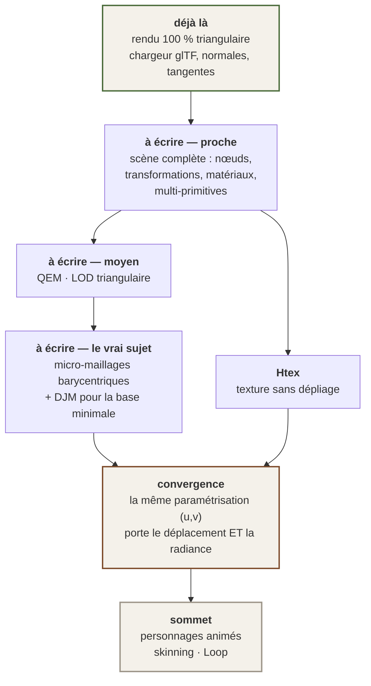

# 05 — La géométrie : le pari du tout-triangle

> **Ce moteur ne connaîtra jamais le quadrilatère.** Ce n'est pas une conséquence subie de Vulkan :
> c'est une décision, et cette page dit ce qui la fonde, ce qui la coûte, et ce qui reste entièrement
> à écrire.

---

## 1. La bonne nouvelle : au rendu, on y est déjà — entièrement

*Nature : **vérifié dans le code**.*

- **Vulkan ne rastérise que des triangles.** Il n'existe aucun autre primitif de surface.
- **glTF/GLB ne transporte que des triangles** — le chargeur de ce moteur n'a jamais vu un quad.
- Les structures de sommets, de maillages GPU et de primitives : **triangles**, sans exception.

> **Donc la question « comment devenir tout-triangle » n'a pas d'objet pour le rendu : c'est déjà le
> cas, et ça l'a toujours été.** Le quad n'existe nulle part dans ce moteur, et il n'y est jamais
> entré.

### La vraie question, reformulée

> **Que faut-il pour que le triangle soit un CHOIX assumé plutôt qu'une fatalité subie ?**
> C'est-à-dire : **faire en triangles tout ce que le quad prétend faire mieux.**

---

## 2. ⭐⭐ L'argument le plus fort contre le quad — et il est démontrable

L'argument habituel en faveur des triangles est utilitaire : *« le GPU n'en connaît pas d'autres »*.
Il est vrai et faible. Voici le vrai.

> **Un quad est deux triangles dont personne ne choisit la diagonale.**

Un quadrilatère $(\mathbf{a},\mathbf{b},\mathbf{c},\mathbf{d})$ admet deux triangulations :

$$\mathcal{T}_1 = \{\,\mathbf{abc},\ \mathbf{acd}\,\}
\qquad\text{ou}\qquad
\mathcal{T}_2 = \{\,\mathbf{abd},\ \mathbf{bcd}\,\}$$

C'est le logiciel qui tranche, invisiblement. **Et les deux ne décrivent pas la même surface.** Au
centre du quad, $\mathcal{T}_1$ passe par le milieu de la diagonale $\mathbf{ac}$ et $\mathcal{T}_2$
par celui de $\mathbf{bd}$. L'écart vaut **exactement** :

$$\boxed{\;\boldsymbol{\delta} \;=\; \frac{\mathbf{a}+\mathbf{c}}{2} \;-\; \frac{\mathbf{b}+\mathbf{d}}{2}\;}$$

*Vérification directe : pour $\mathbf{a}=(0,0,0)$, $\mathbf{b}=(1,0,0)$, $\mathbf{c}=(1,1,h)$,
$\mathbf{d}=(0,1,0)$, les deux milieux valent $(\tfrac12,\tfrac12,\tfrac{h}{2})$ et
$(\tfrac12,\tfrac12,0)$ ; l'écart est $h/2$, et $\lVert\boldsymbol{\delta}\rVert = h/2$.*

$\boldsymbol{\delta} = \mathbf{0}$ si et seulement si les quatre sommets sont coplanaires. Autrement
dit : **tant qu'un quad reste plan, l'ambiguïté dort. Dès qu'il se déforme, elle se réveille.**

### La conséquence pour ce projet

Le sommet de la pyramide, ce sont des **personnages animés**. Or le skinning déforme précisément les
quads d'un maillage au repos — ils cessent d'être plans, $\boldsymbol{\delta}$ devient non nul, et
**la forme obtenue dépend d'une diagonale que personne n'a choisie**. La littérature de rigging le
dit sans en tirer la conséquence : *« avec un maillage qui se déforme, il faut quand même penser à la
façon dont l'arête invisible du quad est tournée. »*

> **Le quad n'est donc pas une abstraction plus riche que le triangle : c'est une AMBIGUÏTÉ.** Il
> cache une décision au lieu de la donner à l'artiste.
>
> **Travailler en triangles, ce n'est pas descendre d'un niveau — c'est refuser une boîte noire de
> plus.**

---

## 3. Ce que le quad prétend faire mieux, et la réponse triangulaire

| Ce que le quad prétend | La réponse triangulaire | État ici |
|---|---|---|
| **Subdivision** | **Schéma de Loop** (1987) | ⛔ à écrire. *Rien ne presse : c'est un besoin d'auteur, pas de moteur* |
| **Micro-détail, déplacement** | **Micro-maillages barycentriques** + **DJM** pour la base minimale | ⛔ à écrire. ⭐ *c'est là que « changer toute la chaîne » prend son sens* |
| **Ombrage lisse, normales** | Normales par sommet — **identique** | ✅ fait. ⚠ Le vrai sujet n'est pas le quad, c'est le **scintillement spéculaire** |
| **Simplification, LOD** | **QEM** est nativement triangulaire | ⛔ à écrire, quand la géométrie deviendra le sujet |
| **⚠ Dépliage UV** | **C'est le VRAI obstacle** — §6 | ⛔ le sujet le plus intéressant du lot |
| **Boucles d'arêtes, loop cut** | Un problème d'**OUTIL**, pas de format | ⛔ un chantier entier, hors moteur |

### La subdivision : le quad n'est pas nécessaire, Catmull-Clark l'est

La littérature est nette : *« Loop est supérieure sur les maillages triangulaires, Catmull-Clark
l'emporte sur les quads. »* **Le quad n'est pas nécessaire à la subdivision — il est nécessaire à
Catmull-Clark**, qui est un schéma parmi d'autres, devenu standard parce que le cinéma l'a adopté.

Le schéma de Loop, pour un sommet de valence $n$ :

$$\beta_n \;=\; \frac{1}{n}\left(\frac{5}{8} - \left(\frac{3}{8} + \frac{1}{4}\cos\frac{2\pi}{n}\right)^{\!2}\right)$$

$$\mathbf{v}' \;=\; (1 - n\beta_n)\,\mathbf{v} \;+\; \beta_n \sum_{i=1}^{n} \mathbf{v}_i
\qquad\qquad
\mathbf{e}' \;=\; \tfrac{3}{8}(\mathbf{v}_1 + \mathbf{v}_2) + \tfrac{1}{8}(\mathbf{v}_3 + \mathbf{v}_4)$$

où $\mathbf{v}_1,\mathbf{v}_2$ sont les extrémités de l'arête et $\mathbf{v}_3,\mathbf{v}_4$ les deux
sommets opposés. La surface limite est $C^2$ partout sauf aux sommets extraordinaires, où elle est
$C^1$ — exactement le même statut que Catmull-Clark sur les quads.

> ⚠ **Et un résultat qui plaide contre le mélange :** le schéma unifié quad+tri de Stam établit
> **qu'il est impossible d'être $C^2$ à la frontière entre une région quad et une région
> triangulaire.** *Un argument de plus pour ne pas mélanger les deux, plutôt que pour préférer l'un.*

### Le rigging : un problème d'outil, pas de physique

La formulation honnête de la littérature : *« les triangles ne se déforment pas intrinsèquement moins
bien ; le problème est qu'ils rendent le flux d'arêtes propre plus difficile à maintenir. »*

**C'est un problème de MÉTHODE et d'OUTIL, pas de mathématiques.** Le skinning linéaire par
mélange —

$$\mathbf{v}' \;=\; \sum_{j} w_j \, \mathbf{M}_j \, \mathbf{v}, \qquad \sum_j w_j = 1$$

— ne connaît que des **sommets**. Il ignore totalement la topologie des faces. *Un maillage
triangulaire correctement pondéré se déforme exactement aussi bien.*

### Et l'industrie a déjà basculé pour le statique

**Un maillage Nanite est un maillage de triangles**, et Nanite a supprimé la rétopologie, le bake de
normales et les LOD manuels pour tout le décor. *La rétopologie quad survit surtout là où Nanite ne
va pas : les personnages animés.* **Aller là est original et sans filet — donc à faire les yeux
ouverts, avec un banc de déformation qui tranche à la place de l'opinion.**

---

## 4. ⚠ Les trois vrais obstacles, qu'il ne faut pas minimiser

1. **Les outils sont tous écrits pour le quad.** Boucles d'arêtes, `loop cut`, sélection de boucle,
   dépliage : ce sont des opérations qui présupposent une grille de quads. **Faire tout en triangles
   demande donc de repenser les OUTILS, pas seulement le format.** *Ce n'est pas un détour du
   chantier : c'est un chantier.*
2. **Personne d'autre ne le fait pour les personnages animés.**
3. **Le pipeline extérieur reste en quad.** Blender, les assets, ce que les artistes importeront :
   tout arrive en quad et sera trianglé. **Le moteur doit donc être excellent en triangles sans
   exiger que la source le soit.**

> ### ⭐ La conclusion, et elle est libératrice
> **Le cap tout-triangle n'exige AUCUN virage. Il exige de ne pas prendre le virage inverse.**
> Il n'y a rien à rattraper : il y a des conventions à ne pas adopter.

---

## 5. Les micro-maillages barycentriques : « changer toute la chaîne »

C'est la piste la plus prometteuse, et la plus récente.

### Le principe

Une **base triangulaire grossière** + une grille barycentrique + un champ de **déplacement scalaire
compressé**. Chaque triangle de base $T$ est subdivisé récursivement ; au niveau $k$ il porte

$$4^{\,k}\ \text{micro-triangles} \qquad\text{et}\qquad V_k = \frac{(2^k+1)(2^k+2)}{2}\ \text{sommets barycentriques}$$

*Vérification : $V_1 = 6$ (trois sommets d'origine + trois milieux), $V_2 = 15$.*

Chaque sommet ne stocke qu'**un scalaire** — son déplacement le long de la normale interpolée :

$$\mathbf{p}(u,v) \;=\; \mathbf{p}_{\text{base}}(u,v) \;+\; h(u,v)\;\hat{\mathbf{n}}(u,v)$$

### Ce que ça donne en mémoire

Le format compressé de NVIDIA descend jusqu'à **0,5 bit par micro-triangle**. Pour un personnage de
4 000 triangles de base au niveau $k=5$ :

$$4000 \times 4^{5} = 4\,096\,000\ \text{micro-triangles}
\qquad\Longrightarrow\qquad
\frac{4{,}1\times10^{6}}{2\times8} \approx 256\ \text{Ko}$$

À comparer au stockage explicite du même maillage — indices seuls, trois entiers 32 bits par
triangle :

$$4{,}1\times10^{6} \times 3 \times 4 \approx 49\ \text{Mo}$$

**Un facteur d'environ deux cents**, positions non comprises. Et le rendu se fait **directement depuis
la forme compressée, sans coutures**.

> ⭐ **Deux propriétés qui comptent pour ce projet, au-delà du gain de mémoire :**
> - **C'est du triangle natif.** Aucune concession, aucun quad nulle part dans la chaîne.
> - **La coordonnée barycentrique $(u,v)$ ne demande AUCUN dépliage** — voir §6, et voir surtout
>   [04 — La lumière indirecte](04-LUMIERE.md) §4 où la même structure sert de support à
>   la radiance.

### Le pendant amont

**DJM** (*Compact Base Meshes for Displacement Mapping using Triangle Jacobians*, SIGGRAPH 2026)
calcule le **maillage de base minimal** qui porte un déplacement fidèle : une simplification QEM
contrainte à rester **bijective et à faible distorsion**.

La métrique d'erreur quadratique de Garland & Heckbert, pour mémoire :

$$Q \;=\; \sum_{p \in \text{plans}(\mathbf{v})} \mathbf{p}\,\mathbf{p}^{\!\top},
\qquad \mathbf{p} = [a\ b\ c\ d]^{\!\top},\ a^2+b^2+c^2 = 1$$

$$\Delta(\mathbf{v}) \;=\; \mathbf{v}^{\!\top} Q\, \mathbf{v}$$

L'effondrement d'arête optimal se lit en résolvant $\partial\Delta/\partial\mathbf{v} = 0$, soit un
système $4\times4$ par candidat. **Nativement triangulaire, depuis 1997.**

> **La direction que ça dessine, et elle est cohérente avec tout le reste :** base triangle grossière
> + déplacement compressé + subdivision de Loop, plutôt que « quad + Catmull-Clark ». *Rien là-dedans
> n'est un compromis : c'est l'état de l'art de 2026, et il se trouve qu'il est triangulaire.*

---

## 6. ⭐⭐ La convention la plus lourde : les coordonnées UV

Le dépliage UV est un **héritage de 1974** : il existe parce qu'on ne savait pas adresser une texture
autrement qu'en 2D. Il coûte des coutures, du dépliage à la main, de l'empaquetage d'atlas, des
artefacts de filtrage — **et c'est l'obstacle n° 1 du tout-triangle.**

| Piste | Ce que c'est | Verdict |
|---|---|---|
| **Ptex** (Disney) | Une texture **par face**, aucune paramétrisation globale. Standard du cinéma | ⚠ *« ne peut pas être pleinement accéléré sur GPU, et les implémentations existantes sont **limitées aux maillages quad** »* — **inutilisable ici, et c'est ironique** |
| ⭐ **Htex** (arXiv 2207.05618) | Texture **par demi-arête**, pour topologies **arbitraires** | ⭐⭐ **la version qui marche sur les triangles.** La réponse directe à l'objection « en tri le dépliage est un enfer ». **À lire** |
| **Ombrage en espace texture** (FastAtlas, CGF 2025) | Ombrer dans un atlas plutôt qu'à l'écran | ⭐ et il **converge** avec les surfels et le casque — voir ci-dessous |
| **Couleur par sommet** | Le plus simple | ⛔ le détail est plafonné par la densité du maillage |

### ⭐⭐⭐ La convergence — et c'est le résultat le plus intéressant de ce dossier

Quatre problèmes qu'on croyait distincts **ont la même réponse** : *discrétiser la SURFACE, au lieu de
l'écran ou du volume.*

| Le problème | Ce que ça demande |
|---|---|
| La lumière indirecte qui bouge | une représentation de surface |
| Le dépliage UV en tout-triangle | une paramétrisation locale (barycentrique, ou par demi-arête) |
| L'ombrage stéréo sans rivalité binoculaire | ombrer **une fois par surface**, pas une fois par œil |
| Le découplage temporel (géométrie à 72 Hz, ombrage plus lent) | ombrer **ailleurs qu'à l'écran** |

> **UNE seule décision d'architecture les referme tous les quatre.** *C'est le genre de chose qu'on ne
> voit qu'en posant les questions ensemble.*

Et les gains annoncés par la littérature de l'ombrage en espace objet, **à vérifier avant de s'y
engager** : 30 à 45 % d'économie d'ombrage en stéréo (un objet ombré **une fois** pour les deux
yeux) · **zéro rivalité binoculaire** · découplage temporel (géométrie à 90 Hz, ombrage complexe à
45 Hz).

⚠ **Et l'anti-crénelage spéculaire qui va avec dort déjà dans ce dépôt** : le **LEAN mapping**
convertit la variance des normales mip-mappées en rugosité GGX et **tue le scintillement sans
anti-crénelage temporel**. *Le scintillement spéculaire est l'ennemi direct du mot « clarté » — et le
TAA est interdit par [02 — Le budget](02-BUDGET.md) §6.*

---

## 7. L'état de la géométrie dans ce moteur, sans complaisance

*Nature : **MESURÉ**, 4 septembre 2026.*

| | |
|---|---|
| Chargeur glTF | positions, **normales**, tangentes, coordonnées de texture · décalages d'accesseur et pas d'entrelacement gérés |
| ⛔ **Ne lit que `meshes[0].primitives[0]`** | **une vraie scène Blender à plusieurs objets perd tout sauf son premier morceau, en silence** |
| ⛔ Pas de matériaux, pas de hiérarchie de nœuds | donc **aucune transformation d'objet** |
| Instanciation | 3 458 appels de dessin ramenés à **52** |
| ⚠ Dette connue, dépriorisée | ~2 000 appels de dessin par image pour ~25 000 triangles, soit **12 triangles par appel** |
| Subdivision, LOD, micro-maillages | ⛔ **rien** |

### Et le défaut qui enseigne le plus

Le chargeur ne lisait **que les positions** ; la normale était inventée depuis la position. Écart
mesuré avec la normale réelle du fichier : **jusqu'à 88,3°** — c'est-à-dire perpendiculaire, aucune
corrélation. Le détail est dans [01 — La position](01-POSITION.md) §7.

> **Ce défaut a survécu à 221 tests verts, à une lumière PBR complète, à un halo, à une occlusion
> ambiante et à une campagne de mesure GPU — parce que la scène de test est faite de cubes générés en
> code, qui ont leurs normales ailleurs.** La géométrie importée n'avait jamais été le sujet, donc
> personne n'avait regardé.
>
> **Il faut supposer que tout ce qui touche à la 3D « vraie » est dans le même état tant que ça n'a
> pas été regardé de près.**

---

## 8. Le chemin, ordonné

**La règle d'ordre, et elle vient de la direction du projet :**

> On construit le socle en premier — **et on connaît déjà la forme du sommet.**
> *Un socle hexagonal ne supporte pas une pyramide triangulaire, et on ne s'en aperçoit qu'en haut.*

Deux conséquences opposables, à appliquer à **chaque** décision de socle :

- ⛔ **Aucune décision de socle ne doit supposer une géométrie STATIQUE.** C'est le critère de tri le
  plus discriminant de tout ce dossier — il élimine à lui seul plusieurs familles de techniques.
- ⛔ **Aucune décision de socle ne doit supposer un dépliage UV.**

> ⚠ **Et une précision de vocabulaire qui a été corrigée ici même :** l'absence de personnages animés
> a d'abord été qualifiée de *« trou »* et de *« plus gros manque du projet »*. **C'est faux.** Un
> chantier qu'on n'a pas encore attaqué n'est pas un manque, **c'est un ordre**. *Un trou, c'est ce
> qui devrait être là et n'y est pas ; là, rien ne devait y être encore.* Le réflexe d'auditeur
> transforme volontiers une priorité en défaut.
