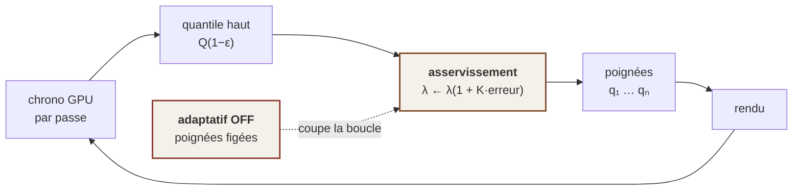

# 06 — L'adaptativité : la seule architecture honnête

> **Un moteur qui ne verra jamais sa machine cible n'a qu'une architecture possible.** Cette page dit
> pourquoi, puis formalise ce qu'il faut construire — parce qu'« un moteur qui s'adapte » n'est pas
> une intention, c'est un asservissement, avec sa consigne, son gain, son hystérésis et son mode
> figé.

---

## 1. Le carrefour, et pourquoi les deux premières voies sont fausses

La question se pose au début, pas à la fin — sinon on écrit deux moteurs sans s'en apercevoir.

| | **Voie 1 — mêmes briques, paramétrées** | **Voie 2 — niveaux de fonctionnalités** |
|---|---|---|
| Ce qui change entre bas et haut de gamme | des **NOMBRES** : moins de cascades, intervalle plus grand, collecte au quart de résolution | des **ALGORITHMES** : éclairage cuit en bas / path tracing en haut ; transparence approchée en bas / tri exact en haut |
| Le risque | plafonner le haut de gamme : une carte puissante ne fera jamais mieux que « la même chose, en plus fin » | **un second chemin est un chemin que personne ne teste** — donc un mécanisme mort en puissance |
| Le coût réel | un seul corps de code à maintenir et à prouver | deux moteurs, et il faut le dire d'avance |

**Ces deux voies portent sur la même chose : *ce qui est écrit dans le code*.** Un corps de code, ou
deux.

> ### ⭐ La troisième voie change le critère
> Elle ne porte pas sur ce qui est écrit, mais sur **ce que la machine choisit à chaque image**.

### Pourquoi elle est meilleure, et pas seulement différente

**1. Un « niveau de matériel » n'existe pas.** Une même machine froide et chaude n'est pas la même
machine. Le mobile bride fort et vite : quand un fondeur optimise avec un studio, son premier geste
est de **verrouiller les fréquences à un niveau tenable indéfiniment** et d'optimiser contre ça — pas
contre le pic. L'appareil d'une étude publiée cette année s'est fait brider **à mi-parcours de son
propre banc**. *Un profil choisi au démarrage est faux vingt minutes plus tard.*

**2. Rendre en dessous de ce que la machine peut donner gaspille de la qualité ; rendre au-dessus fait
une saccade.** **La seule position juste est le bord.**

**3. Et depuis [02 — Le budget](02-BUDGET.md) §4, une raison qui n'est plus une préférence :** on ne
pourra jamais mesurer la limite d'une machine qu'on n'aura jamais. *Les deux premières voies supposent
toutes les deux qu'on puisse mesurer la machine cible pour la calibrer. La troisième est la seule qui
tienne quand on ne le peut pas.*

---

## 2. Ce qu'il faut construire, formellement

### Le problème

Soit $n$ briques de rendu, chacune munie d'une **poignée** $q_i \in [0,1]$ (nombre de cascades,
résolution de collecte, nombre de taps d'ombre, échantillons par tuile…). Notons :

- $c_i(q_i)$ le **coût** en millisecondes de la brique $i$ ;
- $U(\mathbf{q})$ une **qualité perçue** agrégée, croissante en chaque $q_i$ ;
- $T_c$ l'**échéance** — 13,9 ms sur la machine de référence.

Le moteur doit résoudre, **à chaque image** :

$$\max_{\mathbf{q}\,\in\,[0,1]^n} \; U(\mathbf{q})
\qquad \text{sous} \qquad
c_0 + \sum_{i=1}^{n} c_i(q_i) \;\le\; T_c$$

où $c_0$ est le coût incompressible.

### ⭐⭐ La condition d'optimalité, et elle dit quelque chose de concret

Le lagrangien s'écrit

$$\mathcal{L}(\mathbf{q},\lambda) \;=\; U(\mathbf{q}) \;-\; \lambda\left(\sum_i c_i(q_i) - T_c + c_0\right)$$

et l'annulation du gradient donne, pour toute brique intérieure à son domaine :

$$\boxed{\;\frac{\partial U/\partial q_i}{\partial c_i/\partial q_i} \;=\; \lambda \qquad \forall i\;}$$

> **À l'optimum, toutes les briques ont exactement le même rapport « qualité gagnée par milliseconde
> dépensée ».** Tant que deux briques ont des rapports différents, on peut prendre du temps à la moins
> rentable pour le donner à la plus rentable, et l'image s'améliore à budget constant.

**Ce que ça impose en pratique, et c'est vérifiable brique par brique :**

- Chaque brique doit exposer **son coût mesurable** ($c_i$) — c'est déjà le cas, `chrono_gpu.rs`
  chronomètre chaque passe individuellement, et cette capacité est **prouvée par mutation** : une
  boucle inutile ajoutée à un seul shader multiplie *son* chiffre par ~250 sans qu'aucun autre ne
  bouge.
- Chaque brique doit exposer **une poignée numérique continue** ($q_i$) — ce n'est **pas** le cas
  aujourd'hui pour la plupart.
- Et il faut une estimation, même grossière, de **$\partial U/\partial q_i$** — c'est-à-dire de ce
  que chaque poignée apporte à l'œil. **C'est le point dur, et il n'est pas résolu :** la qualité
  perçue n'a pas de mesure objective, et le seul juge du rendu perçu reste un œil humain.

### La loi de commande : un seul scalaire à asservir

L'intérêt de la formulation lagrangienne est qu'elle **réduit la commande à une seule grandeur**. On
n'asservit pas $n$ poignées : on asservit $\lambda$, et les poignées en découlent par inversion de la
condition d'optimalité.

$$\lambda_{k+1} \;=\; \lambda_k \cdot \left(1 + K\,\frac{\widehat{T}_k - T_c}{T_c}\right)$$

$$q_i^{(k+1)} \;=\; \big(\partial c_i\big)^{-1}\!\left(\frac{\partial U/\partial q_i}{\lambda_{k+1}}\right)$$

*Une seule constante de réglage, $K$, au lieu d'une par brique. C'est exactement ce que ce projet
cherche : une constante qui gouverne au lieu de $n$ constantes qui se contredisent.*

---

## 3. ⚠⚠ Trois pièges qui tuent un asservissement, nommés d'avance

### a) Asservir la MOYENNE sur une échéance dure est une faute

C'est le piège le plus grave, et il est chiffrable **avec les mesures de ce moteur**.

Le pire cas mesuré vaut **jusqu'à dix fois la moyenne** — 0,215 ms de moyenne pour 0,554 ms de pic sur
971 images, jusqu'à 2,4 ms sur une autre campagne. **Sur un écran plat, rater une image fait une
saccade ; dans un casque, ça fait un malaise.** La grandeur à tenir n'est donc pas $\mathbb{E}[T]$
mais un **quantile haut** :

$$\widehat{T}_k \;=\; Q_{1-\varepsilon}\big(T\big)
\qquad\text{tel que}\qquad
\mathbb{P}\big(T > T_c\big) \;<\; \varepsilon$$

Pour rater moins d'une image sur mille à 72 Hz — soit une toutes les quatorze secondes, ce qui est
déjà beaucoup — il faut asservir le quantile à **99,9 %**, pas la moyenne.

> **Un asservissement qui vise la moyenne d'une distribution dont la queue est dix fois plus longue
> rate structurellement son échéance.** *Et il paraîtra fonctionner parfaitement sur un banc.*

### b) L'hystérésis n'est pas optionnelle

**Un réglage qui oscille entre deux qualités est pire qu'un réglage médiocre stable.** L'œil ne voit
pas la qualité absolue, il voit la variation.

Deux seuils, jamais un :

$$\text{descendre si } \widehat{T} > T_{\text{haut}}
\qquad\qquad
\text{monter si } \widehat{T} < T_{\text{bas}}, \quad T_{\text{bas}} < T_{\text{haut}}$$

*Ce projet connaît déjà ce patron ailleurs : un autre mécanisme y porte une hystérésis 85 % / 40 %,
pour cette raison exacte.*

### c) Le retard de mesure, qui rend un gain trop fort instable

Le GPU travaille de façon asynchrone : un horodatage n'est lisible qu'une ou deux images après
l'émission. La boucle a donc un **retard pur** $d$.

Un intégrateur bouclé sur un retard oscille dès que le gain dépasse un seuil qui **décroît avec $d$** :
la correction appliquée à l'image $k$ répond à un état vieux de $d$ images, et se cumule avec des
corrections déjà en vol.

$$\text{stabilite} \;\Longrightarrow\; K \;\lesssim\; \frac{\pi}{2\,d} \quad \text{(ordre de grandeur, } d \text{ en images)}$$

> **`CONJECTURÉ`** — cette borne est l'ordre de grandeur classique pour un intégrateur pur avec
> retard ; elle n'a été ni dérivée pour ce cas précis, ni mesurée. *Elle est écrite pour qu'on la
> vérifie, pas pour qu'on la croie.* Ce qui est certain et suffit à concevoir : **le gain doit décroître
> quand le retard croît, et le retard est une propriété de l'instrument, pas du rendu.**

---

## 4. ⛔ La ligne rouge

> **Ce que l'asservissement tourne, ce sont des NOMBRES. Jamais un choix entre deux algorithmes.**
>
> Le jour où il choisit entre deux algorithmes, il y a **deux moteurs, dont un seul est testé.**

Ce que ça autorise, brique par brique :

| Brique | Poignée légitime | ⛔ Interdit |
|---|---|---|
| Ombres | résolution de carte, nombre de taps, mise à jour étalée sur plusieurs images | basculer entre carte d'ombre et ombres tracées |
| Cascades de radiance | nombre de cascades, intervalle de base, budget de rayons | basculer entre cascades et éclairage cuit |
| Collecte finale | quart de résolution → pleine résolution | basculer entre deux débruiteurs |
| Éclairage direct | 1 → 4 échantillons par tuile | basculer entre différé et forward |
| Cartes de géométrie | `RGBA8` octaédrique → `RGBA16F` | — *c'est un nombre : la taille d'un texel* |

*Le dernier cas mérite un mot : changer un format n'est pas changer d'algorithme, et il double la
surface de verre tenable ([03 — La matière](03-MATIERE.md) §5). **Un format est une
poignée légitime, et c'est l'une des plus rentables**, puisque la mémoire est la ressource rare.*

---

## 5. ⚠⚠ Le paradoxe de l'instrument, et il est structurel

> **Un système qui change tout seul est le contraire d'un banc déterministe.**

Si l'adaptativité tourne pendant une mesure, **l'instrument modifie ce qu'il mesure** : on rend une
image plus légère parce qu'on mesurait, donc on mesure une image plus légère. C'est la pire faute
possible pour une chaîne de mesure — *toutes les conclusions deviennent fausses, y compris les
négatives, et rien ne le signale jamais.*

**Il faut donc, dès la première ligne, un mode figé.** Pas un réglage de confort : une condition de
possibilité de toute mesure ultérieure.

---

## 6. ⚠ Conséquence de conception, valable dès aujourd'hui

**L'adaptativité n'est pas une étape de fin, c'est une CONTRAINTE.** Toute brique du rendu naît avec :

1. ses **poignées numériques** ;
2. son **coût mesurable** par le chronomètre GPU ;
3. la possibilité d'être **figée** pour la mesure.

**Une brique écrite sans ça devra être réécrite** — et ce genre de décision coûte peu au début, très
cher après.

### Où en est ce moteur, honnêtement

| | État |
|---|---|
| Chronomètre GPU par passe | ✅ **fait**, prouvé par mutation (×250 sur la passe touchée, rien sur les autres) |
| Coût individuel de chaque passe existante | ✅ mesuré : ombres 0,226 ms · halo 0,31 ms · occlusion 0,27 ms |
| Poignées numériques exposées | 🟡 **partiel** — les briques ont des paramètres, aucun n'est exposé à un asservissement |
| Quantile haut plutôt que moyenne | ⛔ le banc rend moyenne **et** pire cas, mais rien ne les asservit |
| Mode figé | ⛔ **rien** — et il n'y a rien à figer tant qu'il n'y a pas de boucle |
| Estimation de $\partial U/\partial q_i$ | ⛔ **rien**, et c'est le point dur |
| **La boucle elle-même** | ⛔ **rien.** Pas une ligne |

> **Il n'y a donc aujourd'hui aucune adaptativité dans ce moteur.** Il y a l'instrument qui la rendrait
> possible, et une architecture qui l'attend. *L'écrire autrement serait exactement la famille de
> défauts que [01 — La position](01-POSITION.md) §4 décrit.*

---

## 7. Ce qui reste à trancher

Trois questions qui appartiennent à la conception, pas à cette page → [08 — Ce qui est ouvert](08-OUVERT.md) :

1. **Quelle qualité perçue ?** $U$ n'a pas de définition. Faut-il l'approcher par une métrique
   d'image, la faire régler à la main sur quelques scènes de référence, ou renoncer à une $U$ globale
   et fixer un ordre de priorité entre briques ?
2. **Un budget par passe, ou un budget global ?** La formulation lagrangienne suppose un budget global
   redistribuable. Un budget par passe est plus simple à raisonner et **strictement moins bon** — mais
   il ne demande aucune estimation de $\partial U$.
3. **Que fait la boucle quand elle sature ?** Si toutes les poignées sont au minimum et que l'échéance
   est toujours ratée, il faut une réponse — et elle ne peut pas être « changer d'algorithme ».

---

## Ce que cette page autorise à conclure

- L'adaptativité est **la seule architecture cohérente** avec un budget qu'on ne pourra jamais
  vérifier. Ce n'est pas une préférence.
- Elle se formalise proprement : **un problème d'allocation sous contrainte**, dont l'optimum égalise
  le rendement marginal de toutes les briques, et dont la commande se réduit à **un seul scalaire**.
- Ses trois pièges sont connus d'avance : **asservir un quantile et non la moyenne**, l'hystérésis,
  et le retard de mesure.
- **Rien n'en est écrit.** Ce qui existe, c'est l'instrument — et il est prouvé.
