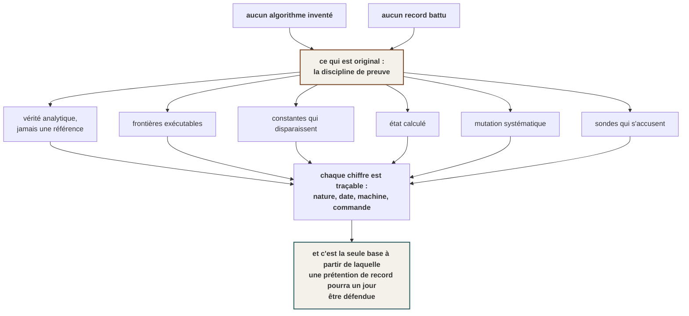

# 07 — La méthode : ce qui est déjà original, et ce qui ne l'est pas

> **Ce moteur n'a inventé aucun algorithme.** Il regroupe et concrétise en un seul endroit des
> travaux que d'autres ont publiés. Cette page dit ce qui, malgré tout, ne se trouve nulle part
> ailleurs sous cette forme — **et ce n'est pas un algorithme, c'est une discipline de preuve.**
>
> Elle dit aussi, en fin de page, ce que cette discipline **ne** donne **pas**.

---

## 1. Le constat, sans adoucissement

| Ce qu'Aegis prétend | Où il en est |
|---|---|
| Une qualité de rendu inédite sur Meta Quest 2 | **Aucun Quest 2 n'a jamais fait tourner Aegis**, et il n'y en aura jamais |
| Battre les moteurs établis en performance | **Aucune comparaison n'a été faite**, sur aucune machine |
| Une originalité mathématique | **Aucun algorithme n'a été inventé.** Snell, Fresnel, Newton, Beer-Lambert, l'équation du transfert radiatif : tout est classique, souvent centenaire |
| Un moteur complet | Sept phénomènes physiques sur dix-huit, aucun support VR, aucune lumière indirecte, aucune CI |

**Rien de ce dossier ne doit laisser croire l'inverse.** Et pourtant il y a bien quelque chose ici
qu'on ne trouve pas ailleurs.

---

## 2. ⭐ Ce qui est réellement original : sept pratiques, et leur combinaison

⚠ **Aucune n'est inédite isolément.** La confrontation à une solution manufacturée est la norme en
calcul scientifique ; le test de mutation existe depuis les années 1970 ; calculer un état plutôt que
l'écrire est du bon sens. **Ce qui est rare, c'est de les appliquer toutes, ensemble, à un moteur de
rendu temps réel** — un domaine où la vérification se fait traditionnellement à l'œil, sur des
captures, en comparant à une image de référence produite par le même auteur.

### a) On mesure contre une VÉRITÉ, jamais contre une référence

C'est le principe central, et il est plus strict qu'il n'en a l'air.

> **On ne compare jamais le GPU au processeur.** Deux implémentations issues du même raisonnement
> peuvent être fausses **exactement de la même façon**, et leur accord ne prouverait que leur
> parenté.

Chaque calcul est confronté **séparément** à une grandeur que personne dans ce projet n'a choisie :

| Ce qu'on mesure | La vérité, indépendante de nous |
|---|---|
| Où le rayon ressort d'une bille | l'intersection **analytique** rayon-sphère |
| La réflectance à incidence normale | $\left(\frac{n_1-n_2}{n_1+n_2}\right)^2 = 4{,}00\%$, dans tous les manuels d'optique |
| L'angle critique | $\arcsin(n_2/n_1) = 41{,}81°$ |
| Le volume d'un maillage de sphère | $\tfrac{4}{3}\pi = 4{,}18879$ |
| Les normales d'un modèle importé | **l'attribut du fichier**, que le moteur ignorait |

*C'est ce qui rend une mesure probante : elle ne compare pas deux de nos calculs entre eux.*

### b) La frontière moteur/jeu est **exécutable**, pas conventionnelle

> **Le moteur fournit ce qui est VRAI, le jeu fournit ce qui est BEAU.**

Ce n'est pas une maxime : **un test parcourt tous les shaders compilés du moteur et échoue sur tout
littéral de couleur à trois composantes différentes.** Une couleur est une décision d'artiste ; elle
n'a rien à faire du côté du moteur.

**Et cette garde a mordu**, sur son auteur, quelques jours après sa naissance. Un premier jet du
shader de réfraction calculait un environnement — une grande fenêtre, un sol sombre, quelques nombres
— directement dans le code. **Le test l'a refusé dans l'heure.** *Où se trouve une fenêtre et combien
elle éclaire sont des décisions de SCÈNE. Les graver dans le moteur, c'est mettre un habitacle de
voiture dans un moteur qui vise tous les mondes.*

La réponse fut celle qu'on applique depuis : **la géométrie entre par deux cartes, la matière par un
volume, la lumière incidente par une carte d'environnement.** Le shader ne sait plus rien de ce qu'il
reflète.

> **Écrire une règle est la moitié du travail ; la rendre inatteignable est l'autre.**

### c) Les constantes arbitraires **disparaissent** au lieu de rétrécir

Ce n'est pas une préférence esthétique, c'est un critère de conception opposable. Réduire un chiffre
reste de la force brute ; **l'élégance, c'est quand le problème cesse d'exister.**

| La constante qu'on aurait écrite | Ce qui l'a remplacée |
|---|---|
| `if angle > 41.81` pour la réflexion totale | **l'absence de racine** dans l'équation de Snell |
| Un seuil de halo réglé à l'œil (0,8 ? 1,0 ? 1,2 ?) | **le point blanc de la courbe de tonalité**, divisé par l'exposition — deux grandeurs qui ont déjà un sens physique |
| Une largeur d'horizon et une courbe de dégradé pour l'ambiante | $\frac{\omega_y+1}{2}$, **l'intégrale analytique** d'un ciel bicolore sur l'hémisphère |
| Une tolérance de mesure choisie à la main | **l'amplitude réelle de la grandeur à l'intérieur d'un pixel** |
| Un seuil absolu d'erreur pour la réfraction | **la décroissance** de l'erreur avec la résolution — *un seuil se périmerait à la première carte différente, une tendance non* |

### d) Un cas particulier exact, plutôt qu'une branche

Quand la marche inhomogène a remplacé la formule fermée de Beer-Lambert, la tentation était d'écrire
`si le milieu est homogène, alors …`. **Elle a été refusée**, et la mesure a montré pourquoi elle
n'était pas nécessaire :

$$\sum_{j<N} \sigma\,\Delta s \;=\; \sigma D
\qquad\Longrightarrow\qquad
\textbf{0 octet d'écart sur 262 144}$$

> **Un second chemin est un chemin à tester pour toujours, et le premier à diverger.**

### e) L'état du projet se **calcule**, il ne se raconte pas

`examples/etat` relit le disque à l'instant : lignes vivantes et endormies, fichiers, shaders
réellement compilés, ce que le moteur exige d'une carte, et ce que personne n'appelle.

Ce bloc était en prose jusqu'au 3 septembre 2026, et il portait « 13 337 lignes, 85 tests, 2 228
endormies ». **Trois jours plus tard les trois chiffres étaient faux, et rien ne le disait.**

> **Un texte se recopie, donc il diverge ; une commande, non.**

*C'est la troisième fois que ce principe est appliqué dans ce projet, et à chaque fois pour la même
raison : une affirmation vérifiable n'a rien à faire dans de la prose — elle s'y périme en silence,
avec l'autorité d'une note qu'on croit vérifiée.*

### f) Le test de mutation, et il a démasqué une garde décorative

**Remettre le défaut, vérifier que le test tombe, restaurer.** Sans ça, un test peut être
parfaitement vert et ne rien garder.

**Cas vécu, et il est instructif.** Un test avait été écrit pour le décalage d'accesseur du chargeur
glTF, sur les modèles du dépôt. En réintroduisant le défaut : **il restait vert.** Mesure faite
ensuite sur les dix modèles — *aucun* n'a de décalage d'accesseur, *aucun* ne partage une vue de
tampon. **Le cas n'existait pas dans nos fichiers, donc aucun test bâti sur eux ne pouvait mordre.**

Remplacé par un fichier **fabriqué dans le test**, et celui-là tombe sous mutation.

> **Sans cette discipline, on livre une garde décorative — et le prochain à toucher ce fichier la
> croira.**

### g) Une sonde doit savoir dire quand elle échoue

La sonde qui cherche les modules orphelins porte un **calibrage** : deux orphelins connus d'avance
qu'elle doit retrouver, cinq modules vivants qu'elle ne doit pas accuser. Sa sortie du jour :

```
  Calibrage : 0/2 orphelins connus retrouvés · 5/5 modules vivants correctement innocentés.
  ⚠⚠ LA SONDE EST FAUSSE — ne pas croire la liste ci-dessus.
```

**Elle s'accuse elle-même**, au lieu de rendre une liste plausible.

> *Une sonde qui ne sait pas dire quand elle échoue est pire qu'une absence de sonde : elle produit
> une réponse crédible et fausse. La question qui les attrape toutes : **cette sonde répondrait-elle
> différemment si le défaut était là ?***

---

## 3. Pourquoi ça compte, et pas seulement pour la propreté

**Un record annoncé sans instrument honnête n'est rien.**

Ce projet prétend viser une qualité et une fluidité inédites sur une machine qu'il ne possédera
jamais. Dans ces conditions, **la seule chose qui puisse rendre une telle affirmation défendable un
jour, c'est la traçabilité de chaque chiffre** : sa nature, sa date, sa machine, et la commande qui
le rejoue.

C'est aussi ce qui permet de **changer d'avis vite**. Trois exemples récents où une mesure a corrigé
une conclusion écrite le jour même :

| Ce qui était écrit | Ce que la vérification a montré |
|---|---|
| *« les cascades de radiance n'exigent aucun lancer de rayons matériel »* | Le papier de référence tourne **sur OptiX**, et coûte 8,6 à 11,5 ms sur une RTX 3080 **pour un œil**. L'erreur portait sur l'implémentation, pas sur la famille — mais elle était écrite comme un fait |
| *« notre monde est une grille de voxels, c'est peut-être notre avantage décisif »* | C'était une propriété du **jeu**, attribuée au **moteur** — le jour même où la frontière entre les deux était écrite |
| *« l'approximation classique se trompe de 1,8° »* | Le banc balayait **une ligne** d'écran. Sur l'image entière : **36,4°**, vingt fois pire |

> **Le troisième cas est le plus utile à connaître :** quand une image et un banc ne s'accordent pas,
> **c'est que le banc mesure autre chose que ce qu'on croit.**

---

## 4. ⚠ Les quatre erreurs qui ont fondé ces règles

*Elles sont ici parce qu'un exemple vécu enseigne un comportement mieux qu'une consigne — et parce
qu'un dossier qui ne montre que ses succès n'apprend rien à personne.*

### a) Un mécanisme jamais exercé est mort, et rien ne le dit

**C'est la famille de défauts n° 1 de ce projet.** Du code câblé, commenté, testé parfois, qui a
l'air complet — et qui n'a jamais tourné une seule fois pour de vrai.

Le cas le plus net : un contexte Vulkan **sans fenêtre** existait, écrit, complet, soigneusement
documenté, **et appelé par rien depuis sa naissance**. C'était pourtant la seule chose qui permettait
à des tests de regarder un vrai pixel produit par la carte graphique.

**Le jour où il a enfin tourné, il a rendu trois défauts** : un plantage dans un destructeur qui
détruisait sans condition une chaîne de présentation absente, une fuite mémoire qu'aucun
avertissement ne pouvait signaler, et une exigence « Vulkan 1.4 » que le moteur n'utilisait nulle
part — mais qui pouvait faire refuser sa **première** fonction Vulkan sur mobile.

> **Un mécanisme jamais exercé ne cache pas un défaut : il en cache trois.**

Et sa forme la plus vicieuse : *un commentaire qui décrit une GARANTIE que le code ne tient pas*. Ce
contexte disait noir sur blanc « rien ne doit les appeler » à propos de certains chargeurs
d'extension nuls. **Le destructeur les appelait.**

### b) Une somme de corrections justes ne franchit pas un mécanisme absent

Une journée entière de corrections **toutes justes**, mesurées, testées et validées une à une n'a pas
approché la cible visuelle. Aucune n'était fausse ; aucune n'a été défaite. **Le défaut était dans
l'ADDITION** : la cible reposait sur cinq mécanismes que le moteur ne possède pas.

> **C'est le plus difficile à voir, parce que rien ne clignote quand chaque étape passe.** Quand
> plusieurs corrections justes n'améliorent pas le ressenti, cesser de corriger et se demander ce qui
> manque **au niveau en dessous**.

### c) Un raccourci technique qui fonctionne grave une contrainte artistique

La conclusion *« notre monde est une grille de voxels, donc le lancer de rayons logiciel y est presque
gratuit »* était **techniquement exacte** — une grille se traverse par un DDA. Et c'est précisément ce
qui la rendait dangereuse.

> **Un raccourci technique qui fonctionne est exactement ce qui grave une contrainte artistique dans
> un moteur, sans que personne ne décide rien.**

*L'erreur a été commise le jour même où la frontière moteur/jeu était écrite. **Écrire une frontière
ne suffit pas à la tenir.***

### d) Quand l'instrument modifie ce qu'il mesure, toutes les conclusions sont fausses

Une suite de tests plantait **une fois sur quatre**, par erreur de segmentation, **après** que tous
les tests aient affiché `ok`. Aucune assertion en échec, aucun coupable nommé. *C'est le pire mode de
panne possible pour un instrument : il ne dit pas qu'il est cassé, il dit « rouge, débrouille-toi ».*

Et deux sondes ont menti pendant le diagnostic, toutes deux **vers le pessimisme** : `cargo test … |
tail` rend « exit code 0 » sur une exécution qui plante — `$?` lit le code de `tail` — et précharger
un pilote graphique dans le processus a donné 20 crashs sur 20, un déterminisme trop net pour être la
course cherchée : **la sonde mesurait son propre effet.**

> **Devant un plantage intermittent, mesurer un TAUX avant de conclure quoi que ce soit.** Et
> vérifier que la sonde de confirmation est neutre.

---

## 5. ⛔ Ce que cette méthode NE donne PAS

*Sans cette section, cette page serait une plaidoirie.*

- **Elle ne produit aucune image.** Un moteur se juge sur ce qu'il rend, et sept phénomènes sur
  dix-huit ne font pas une image.
- **Elle ne remplace pas un œil.** Pour tout ce qui touche au rendu **perçu**, le juge est un humain,
  et une garde parfaitement verte a déjà été contredite par un regard : *ce qui fait reculer un décor
  est la **taille apparente**, pas la profondeur.* **Quand un test vert contredit un œil sur du rendu
  perçu, c'est le test qui a tort** — il mesure une grandeur voisine de celle qui compte.
- **Elle coûte du temps.** Chaque mesure demande son banc, sa vérité analytique, sa mutation. C'est
  une part importante du travail, et elle ne se voit pas à l'écran.
- **Elle ne dit rien de la machine cible.** Tous les chiffres de ce dossier viennent d'une carte de
  bureau. Sur le Quest 2, **la rigueur de la méthode ne compense pas l'absence de mesure**.
- **Et elle conditionne.** Un corpus lourd de témoignages d'erreurs pousse à **auditer plutôt qu'à
  construire** — c'est un effet de dose, pas un défaut du contenu. *Le réflexe d'auditeur a déjà
  transformé une priorité (« les personnages animés viendront plus tard ») en défaut (« c'est le plus
  gros trou du projet »). Ce n'était pas la même chose, et la nuance compte.*

---

## 6. Ce que ça vaut, au total



**La formule honnête est celle-ci :** ce moteur n'a pas encore d'apport algorithmique, et il a un
apport méthodologique réel — *appliquer à un moteur de rendu temps réel la discipline de preuve du
calcul scientifique, jusqu'à rendre les fautes inatteignables plutôt que déconseillées.*

**C'est peu, comparé à l'ambition affichée. C'est beaucoup, comparé à rien.** Et c'est ce qui rendra
la suite mesurable.
