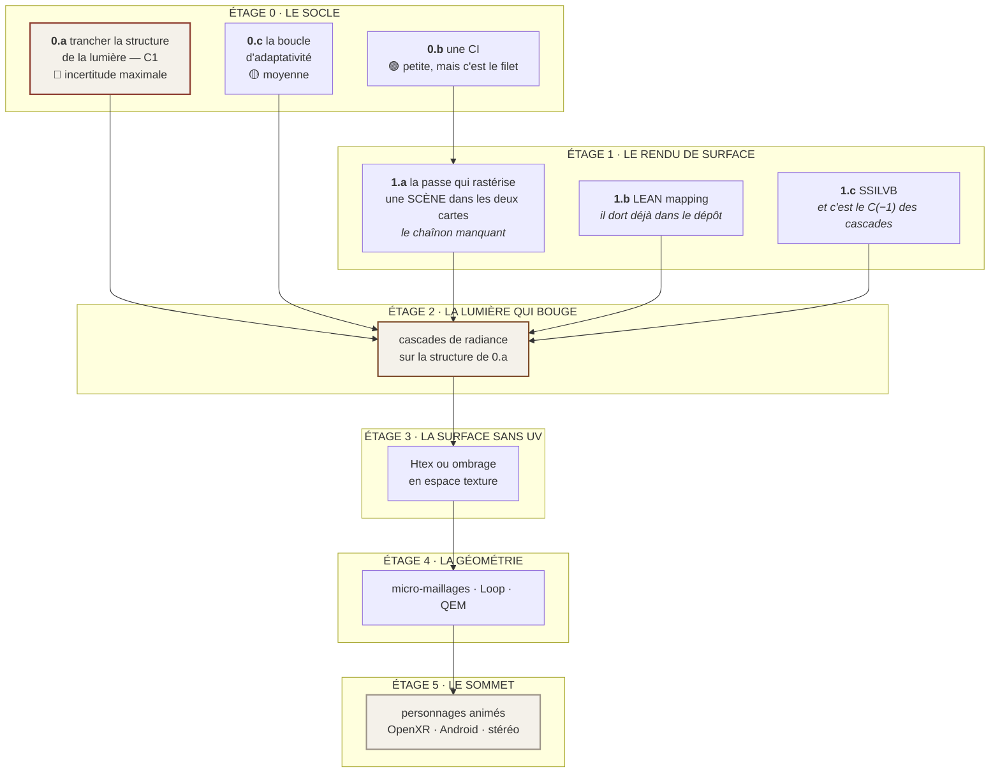

# 08 — Ce qui est ouvert : les carrefours, les trous, et le programme

> **C'est la page la plus utile du dossier**, et la seule qui compte vraiment si vous lisez pour
> contribuer ou pour contredire. Elle liste ce qui n'est **pas** décidé, ce qui n'est **pas** mesuré,
> ce qui n'est **pas** lu — et dans quel ordre attaquer.

---

## 1. Les carrefours non tranchés

*Chacun avec ses options, son coût, et **ce qu'il faudrait mesurer pour trancher**. Un carrefour sans
critère de décision n'est pas un carrefour : c'est une hésitation.*

### ⭐⭐ C1 — Sur quelle structure la lumière voyage-t-elle ? · risque 🔴 maximal

**Rien d'autre ne peut être décidé avant.** Cette décision commande la lumière indirecte, la texture,
l'ombrage stéréo et le découplage temporel **d'un seul coup**.

| Option | Pour | Contre |
|---|---|---|
| **Surfels** | Quatre équipes indépendantes y convergent, dont une **en production sur mobile**. Pas d'UV, supporte le skinning, empreinte prévisible | Un nuage sans topologie : recherche spatiale pour trouver les voisins, coutures d'interpolation, gestion naissance/mort |
| **Micro-triangles barycentriques** | Connectivité gratuite, interpolation continue, suivent la déformation sans être re-semés, **moins de mémoire par échantillon** (ni position ni normale à stocker) | **Personne ne l'a fait.** Aucune mesure, aucun précédent, aucun code à lire |

> **Ce qu'il faut mesurer pour trancher, et ce n'est pas philosophique :**
> **Combien coûte le parcours de rayons entre micro-triangles, *sans* structure d'accélération
> spatiale, comparé au parcours entre surfels *avec* ?** Sur une machine limitée par la mémoire d'un
> facteur seize, la réponse peut renverser la préférence dans les deux sens.

Détail complet : [04 — La lumière indirecte](04-LUMIERE.md) §4.

### C2 — S'appuyer sur la reprojection du casque ? · risque 🟠 élevé

Le rendu à demi-cadence avec synthèse par le casque **double le budget** : 13,9 → ≈ 27,8 ms. C'est de
loin le levier le plus puissant du dossier.

⚠ **Mais c'est une reprojection temporelle**, la famille même que ce dossier écarte
([02 — Le budget](02-BUDGET.md) §6). La distinction est réelle : elle est appliquée **par le casque,
sur l'image finie**, avec les vecteurs de mouvement qu'on lui fournit — ce n'est pas un débruiteur qui
reconstruit un signal bruité.

> **Ce qu'il faut d'abord :** `VK_KHR_multiview` (prérequis absolu, **inexistant ici**), puis une
> mesure d'artefacts en conditions réelles. **Et ça demande un casque.** *C'est donc un carrefour qui
> ne pourra jamais être tranché par la mesure dans ce projet — seulement par un utilisateur.*

### C3 — Le format de la transmittance dans les cascades · risque 🟡 moyen

Un $\beta$ spectral ferait entrer l'absorption dans le socle et refermerait quatre lignes de l'étalon
d'un coup ([04 — La lumière indirecte](04-LUMIERE.md) §6). Il coûte de la
mémoire :

| | $\beta$ binaire | $\beta$ RVB 8 bits | $\beta$ RVB 16 bits |
|---|---|---|---|
| bits par entrée | 49 | 72 | 96 |
| rapport | ×1,00 | **×1,47** | **×1,96** |

> **À mesurer :** le coût réel de la fusion en octets par image aux trois formats ; et si 8 bits par
> canal suffisent — la transmittance est bornée dans $[0,1]$ et se lit perceptuellement, donc
> probablement oui.

### C4 — Budget global redistribuable, ou budget par passe ? · risque 🟡 moyen

La formulation lagrangienne de [06 — L'adaptativité](06-ADAPTATIVITE.md) suppose un budget **global**,
et son optimum égalise le rendement marginal de toutes les briques. Elle exige d'estimer
$\partial U/\partial q_i$ — la qualité perçue gagnée par unité de poignée — **et personne ne sait
faire ça objectivement**.

Un budget **par passe** ne demande aucune estimation de $U$, se raisonne facilement, et est
**strictement moins bon**.

> **Ce qui pourrait trancher :** une expérience où l'on fait régler les poignées à la main sur trois
> scènes de référence, et où l'on compare le réglage humain à ce qu'un budget par passe aurait donné.
> *Si l'écart est faible, la simplicité gagne.*

### C5 — Le langage de shaders · risque 🟢 faible, mais il se referme avec le temps

Aujourd'hui : **WGSL compilé en SPIR-V à la construction, sans aucune dépendance à l'exécution.**
11 shaders réels.

| Piste | Ce que ça donnerait | Verdict de travail |
|---|---|---|
| **Rester en WGSL** | Ce qu'on a | ✅ **défaut à conserver.** ⚠ Piège connu : le compilateur **retourne l'axe Y**, et rien dans le code ne le dit — c'est ce qui a sorti le HUD à l'envers avec onze tests verts |
| **Slang** | Modules, génériques, réflexion, dérivation automatique — conçu **pour** le problème des permutations | ⚠ une dépendance de plus, et un compilateur C++ |
| **rust-gpu** | Shaders **en Rust** | 🟡 séduisant pour un projet tout-Rust, mais c'est une chaîne de compilation entière à adopter |
| **Écrire son propre langage** | Cohérent avec la doctrine | ⛔ le plus gros chantier du dossier, **et il ne produit aucune image** |

> ⚠⚠ **Et le mur qui vient, quel que soit le choix : les permutations.** Quatre interrupteurs
> indépendants font **16** variantes ; un éditeur de graphes est un **multiplicateur par-dessus** —
> 100 permutations d'éclairage × 100 graphes = **10 000 shaders** à compiler, stocker et charger. Sur
> une machine où la mémoire est rare, ce n'est pas un inconfort de compilation : c'est un coût de
> démarrage et de premier affichage saccadé chez celui qui joue. **Toute conception de système de
> shaders doit dire, dès sa première page, comment elle borne ses permutations.**

### C6 — Les inclusions fines · risque 🟡 moyen

Un volume cuit ne peut pas porter des bulles fines : il faudrait ≈ 27 Go
([03 — La matière](03-MATIERE.md) §6). Trois pistes, **aucune
instruite** : volume creux · détail procédural par-dessus une structure grossière · inclusions
instanciées.

*C'est une propriété du choix d'architecture, pas un défaut d'implémentation : une grille régulière
paie **partout** la finesse dont elle n'a besoin **que par endroits**.*

### C7 — Une version du moteur, ou plusieurs ? · risque 🟢 faible

La doctrine penche pour **une seule**, qui s'adapte. *Une seconde version est une version que
personne ne teste.* ⚠ Mais la taille à l'installation est un vrai sujet, et il est lié à
l'adaptativité : **un moteur qui s'adapte ne doit pas embarquer $N$ jeux de données**, sinon il paie
en octets ce qu'il gagne en souplesse. *La bonne réponse est probablement de faire varier des
**nombres**, pas des assets — la même ligne rouge que pour les algorithmes.*

---

## 2. Les mesures qui manquent

*Rangées par ce qu'elles débloquent, pas par difficulté.*

| # | Ce qu'il faut mesurer | Ce que ça débloque | Faisable ici ? |
|---|---|---|---|
| **M1** | Le parcours entre micro-triangles **sans** structure spatiale, contre surfels **avec** | **C1**, donc tout le reste | ✅ oui, sur un banc processeur d'abord |
| **M2** | Le coût de la passe qui rastérise une **scène complète** dans les deux cartes | Le chaînon manquant entre la physique et une image de jeu | ✅ oui |
| **M3** | Le coût d'un $\beta$ spectral en octets par image | **C3** | ✅ oui, dès qu'une cascade existe |
| **M4** | La cause du **pire cas à 10× la moyenne** | L'asservissement (§C4) : sans elle, on ne sait pas ce qu'on asservit | ✅ oui, et c'est **prioritaire** |
| **M5** | La version Vulkan réelle du Quest 2 | Si c'est 1.1, le repli est `VK_KHR_dynamic_rendering` en extension | 🟡 par la documentation constructeur, pas par la mesure |
| **M6** | Le coût GPU réel sur un mobile | Tout le budget | ⛔ **impossible sans un `.apk`** — le terminal Android n'a pas accès au pilote GPU |
| **M7** | Quoi que ce soit sur Quest 2 | Tout | ⛔ **jamais** |

> ⭐ **M6 change de statut :** l'`.apk` n'est plus « la voie vers une mesure GPU mobile », c'est **la
> seule voie vers une mesure GPU mobile, pour toujours**. Une vraie application Android a accès au
> pilote ; un terminal, non. *Ce n'est plus un chantier de confort : c'est le seul instrument que ce
> projet pourra jamais braquer sur un GPU mobile.*

---

## 3. Les documents non lus, et ce qu'ils coûtent

| Document | État | Pourquoi ça compte |
|---|---|---|
| **Les planches de *Love and Deepspace*** (GDC 2026) | ⛔ **introuvables** — seul le résumé de session a été lu | ⭐⭐⭐ **le trou le plus coûteux du chantier.** C'est le seul cas connu de cascades 3D + surfels **en production sur mobile, en lancer de rayons logiciel** : exactement ce qu'on cherche à faire, déjà fait par quelqu'un |
| **Le papier fondateur de Sannikov** | 🟡 référencé, pas lu en entier | Les formules de cascades citées ici viennent d'une **source pédagogique**, pas de l'original. **À revérifier avant d'écrire une ligne de code dessus** |
| **Les notes de HypeHype** (56 Ko) | 🟡 récupérées, non dépouillées | Le patron d'échantillonnage par tuiles à deux étages, et la règle « fp16 partout, écrit dès le départ » |
| **Smolder** — volumétrique, SIGGRAPH 2026 | ⛔ non ouvert | Moins l'effet que **l'intégration** : comment le volumétrique cohabite avec le reste sans devenir un chemin de rendu à part |
| **Htex** (arXiv 2207.05618) | ⛔ non lu | La réponse directe à « en tout-triangle le dépliage est un enfer » |

---

## 4. Le programme, ordonné

**Le principe d'ordre :** *le socle d'abord, en sachant déjà la forme du sommet.* **Et celui du
projet :** *le mur le plus INCERTAIN d'abord, à la plus petite échelle qui peut le révéler.* Un
chantier long mais sans surprise attend ; un chantier qui peut **invalider le plan entier** passe
devant.

### Ce qui est recommandé, et pourquoi

1. **Commencer par 0.a, et le faire SUR LE PAPIER.** C'est la décision la plus lourde, la plus
   incertaine, et **la moins chère à prendre maintenant** — *chercher le mur sur le papier d'abord.*
   Elle se tranche en lisant deux documents et en écrivant **un banc processeur** (M1), pas en
   écrivant un moteur.
2. **Puis 0.b avant 0.c.** La CI est petite, et c'est le seul filet pour tout ce qui suit — *le rendu
   est précisément ce qui casse en silence.*
   ⚠ **Avec un pré-requis qui n'était écrit nulle part :** la suite de tests plantait une fois sur
   quatre sans nommer de coupable. Une CI posée avant ce correctif aurait été **rouge une fois sur
   quatre sans raison**, sur le premier projet du dépôt à en avoir une. **La fiabilité de la suite est
   une condition de possibilité de la CI.**
3. **Et une chose qui devrait peut-être passer avant tout :** *tout ce dossier suppose une scène 3D.
   Ce moteur n'a jamais affiché autre chose qu'une scène simple générée en code.* Charger un vrai
   modèle depuis Blender, l'éclairer, le regarder — **c'est une demi-journée, et ça dirait plus sur
   l'écart réel que dix documents.** Le chargeur existe déjà.

---

## 5. ⚠ Ce qui invaliderait ce plan

*Une feuille de route qui ne dit pas comment elle peut être fausse n'est pas une feuille de route.*

| Si l'on mesurait… | Alors |
|---|---|
| que le parcours entre micro-triangles coûte plus de deux fois celui entre surfels | **C1 se tranche pour les surfels**, contre la préférence affichée — et il faudra le dire |
| que les cascades 3D ne tiennent pas sous 4 ms sur une machine mobile, même en lancer logiciel | **Toute la famille tombe**, et il ne reste que l'éclairage cuit + espace écran. *Ce serait un résultat, pas un échec* |
| que le Quest 2 est en Vulkan 1.1 | Le repli est une extension à demander, **pas une réécriture** — mais il faut le savoir avant, pas après |
| qu'un $\beta$ spectral coûte plus de 50 % de la bande passante de fusion | L'idée de [04](04-LUMIERE.md) §6 tombe, ou se restreint aux cascades basses |
| que le pire cas à 10× la moyenne vient d'une cause structurelle et non d'un artefact de mesure | **L'adaptativité devient beaucoup plus difficile** : on n'asservit pas une distribution à queue lourde comme une distribution ordinaire |

> **Un résultat négatif est un résultat.** Le but n'est pas d'obtenir des chiffres élevés : c'est de
> comprendre ce qui est vrai.

---

## 6. Ce qu'on aimerait qu'on nous dise

Ce dossier est public pour une raison : **une question extérieure compétente est un instrument de
mesure gratuit**, et elle a un avantage qu'aucune relecture interne n'a — *elle ne partage aucun de
nos présupposés, donc elle demande à voir ce qu'on tient pour acquis.*

Trois choses seraient particulièrement utiles :

1. **Un lien vers les planches de *Love and Deepspace*** (GDC 2026, présenté par Arm). C'est le trou
   n° 1 de ce chantier.
2. **Une réfutation chiffrée de [04 §6](04-LUMIERE.md) §6** — le $\beta$
   spectral. Si quelqu'un l'a déjà essayé et que ça ne tient pas, le savoir maintenant vaut mieux que
   de le découvrir dans six mois.
3. **N'importe quelle mesure prise sur un Quest 2.** Ce projet n'en aura jamais.

Et si vous trouvez une erreur dans ce dossier, **elle est probablement réelle**. Les affirmations y
portent leur nature et leur commande de re-vérification exactement pour ça.

---

## Le résumé, en une page

| | État | Prochain geste |
|---|---|---|
| **Physique de la matière** | 4 phénomènes conquis, démontrés contre des vérités analytiques | **M2** — la passe qui les amène dans une image |
| **Lumière indirecte** | ⛔ rien. Une famille éliminée par la mesure, une famille candidate | **C1** sur le papier, puis **M1** |
| **Géométrie** | rendu 100 % triangulaire · chargeur mono-primitive | Charger une vraie scène Blender |
| **Adaptativité** | l'instrument existe et est prouvé · la boucle n'existe pas | **M4** — expliquer le pire cas |
| **VR** | ⛔ **rien.** Pas d'OpenXR, pas de stéréo, pas d'Android | `VK_KHR_multiview`, puis un `.apk` |
| **Outillage** | tests d'image GPU ✅ · CI ⛔ | **0.b** |
