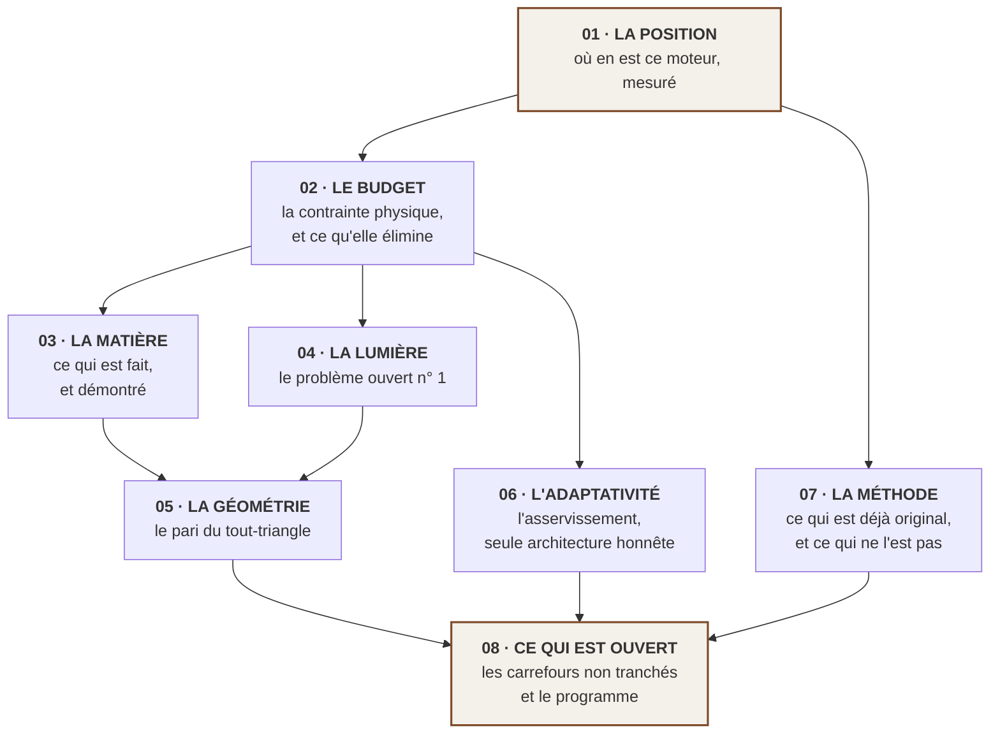
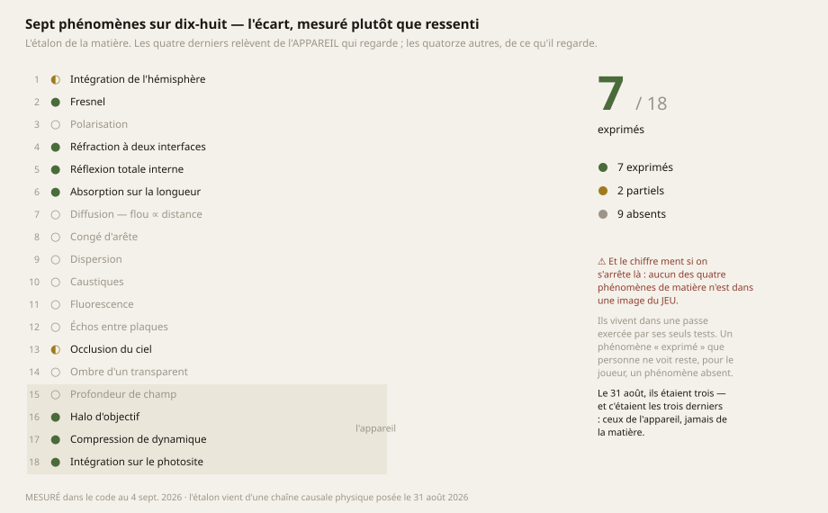

# Aegis — carnet de recherche

> **Un moteur de rendu 3D écrit à la main en Rust, directement sur Vulkan, qui vise une qualité
> d'image et une fluidité inédites sur Meta Quest 2 — et qui n'y est pas.**
>
> Ce dossier dit exactement où il en est, comment on le mesure, et tout ce qui reste à parcourir.
> Il est écrit pour des gens qui connaissent le rendu temps réel. Il ne vulgarise pas.

*A research notebook for Aegis, a hand-written Rust/Vulkan renderer targeting the Meta Quest 2.
Written in French, for readers who already know real-time rendering. Every claim carries its
nature — measured, computed, read elsewhere, or conjectured — and its command to re-check it.*

---

## Pourquoi ce dossier existe

Un moteur de rendu se juge sur des images et sur des millisecondes. Nous n'avons ni les unes ni les
autres à montrer : **Aegis ne bat aucun record aujourd'hui, et il est très incomplet.** Il regroupe
et concrétise en un seul endroit des travaux que d'autres ont inventés ; ce n'est pas encore un
apport.

Écrire ça noir sur blanc n'est pas de la modestie de façade, c'est la seule position à partir de
laquelle on peut travailler. **Le but déclaré du projet est d'être le moteur le plus évolué
mathématiquement, le plus gracieux et le plus original possible** — et une telle ambition ne se
défend que si l'on sait dire, à chaque instant, ce qui est prouvé et ce qui ne l'est pas.

Ce dossier est donc l'inverse d'une vitrine. C'est l'état d'un chantier, avec :

- **ce qui est mesuré**, avec la commande qui le rejoue en dix secondes ;
- **ce qui est calculé** à partir de chiffres qu'on n'a pas vérifiés soi-même, et qui ne servira
  jamais à valider quoi que ce soit ;
- **ce qui est lu chez d'autres**, avec ce que ça ferme et ce que ça ouvre pour nous ;
- **ce qui est conjecturé** — les idées qu'on croit neuves, et dont aucune n'est démontrée.

---

## ⚠ La convention de lecture, et elle est stricte

Chaque affirmation de ce dossier porte **sa nature**. Elles ne se valent pas, et les confondre est
la faute qui coûte le plus cher sur ce terrain.

| Marque | Ce que ça veut dire | Ce que ça autorise à conclure |
|---|---|---|
| **`MESURÉ`** | Un banc déterministe l'a produit, sur une machine nommée, à une date donnée | Que c'était vrai **là**, **ce jour-là**, sur **cette machine** |
| **`CALCULÉ`** | Dérivé de chiffres publiés que nous n'avons pas vérifiés | À **éliminer** des familles de techniques. **Jamais** à en valider une |
| **`LU`** | Publié par quelqu'un d'autre, avec sa référence | Ce que *leur* mesure dit, sur *leur* matériel |
| **`CONJECTURÉ`** | Une idée qui nous paraît juste et que rien ne démontre | Rien. C'est une piste, et elle est étiquetée comme telle |

> **Un chiffre sans son instrument est indéfendable.** C'est pourquoi chaque mesure de ce dossier
> donne la commande qui la reproduit — pas pour la cérémonie, mais parce qu'une mesure qu'on ne peut
> pas rejouer se périme en silence, avec l'autorité d'une note qu'on croit vérifiée.

---

## L'ordre de lecture



1. **[01 — La position](01-POSITION.md)** · *ce que le moteur sait faire, ce qu'il ne sait pas, et
   les chiffres du jour.* **Commencer ici.** Tout le reste suppose de savoir d'où l'on part.
2. **[02 — Le budget](02-BUDGET.md)** · *la seule contrainte dure du projet est physique, et elle
   ferme des familles entières de techniques avant qu'on n'écrive une ligne.*
3. **[03 — La matière](03-MATIERE.md)** · *Snell, Fresnel exact, Beer-Lambert inhomogène, Newton en
   espace écran. Ce qui est fait, avec ses démonstrations et ses mesures.*
4. **[04 — La lumière indirecte](04-LUMIERE.md)** · *le grand chantier. Pourquoi le stochastique est
   hors budget, ce que valent les cascades de radiance, et une idée qu'on croit neuve.*
5. **[05 — La géométrie](05-GEOMETRIE.md)** · *le tout-triangle, ce que le quad cache, et le vrai
   obstacle qui n'est pas celui qu'on croit.*
6. **[06 — L'adaptativité](06-ADAPTATIVITE.md)** · *pourquoi un moteur qui ne verra jamais sa machine
   cible n'a qu'une architecture honnête possible.*
7. **[07 — La méthode](07-METHODE.md)** · *ce qui est réellement original dans ce projet aujourd'hui,
   et ce n'est pas un algorithme.*
8. **[08 — Ce qui est ouvert](08-OUVERT.md)** · *les décisions non tranchées, chacune avec ses options
   et ce qu'il faudrait mesurer pour trancher.*

---

## L'état, en une image

Le moteur exprime **sept** des dix-huit phénomènes physiques qu'une image de matière demande. Le
31 août 2026 il en exprimait **trois**, et c'étaient les trois de l'appareil photographique — jamais
de ce que l'appareil regarde.



⚠ **Et ce chiffre ment si on s'arrête là :** aucun des quatre phénomènes de matière conquis depuis
n'est visible dans une image du jeu. Ils vivent dans une passe exercée par ses seuls tests. *Un
phénomène « exprimé » que personne ne voit reste, pour celui qui regarde, un phénomène absent.*

---

## Ce que ce moteur n'est pas

Trois malentendus qu'il vaut mieux lever tout de suite, parce qu'ils orientent toute la lecture.

- **Ce n'est pas un moteur voxel.** Le jeu qui sert de banc de validation en est un ; le moteur, non.
  La confusion a été commise ici même, le jour où la frontière a été écrite — le récit est dans
  [07 — La méthode](07-METHODE.md), parce qu'il enseigne quelque chose de général sur la façon dont
  une contrainte artistique se grave dans un moteur sans que personne ne décide rien.
- **Ce n'est pas un moteur VR.** Il n'y a **aucun** support VR : pas d'OpenXR, pas de rendu stéréo,
  pas de portage Android. Le Quest 2 est le *cap*, pas une base existante.
- **Ce n'est pas un moteur fini qu'il resterait à optimiser.** La lumière indirecte, la transparence
  triée, le volumétrique, la profondeur atmosphérique, les personnages animés : rien de tout cela
  n'existe.

---

## Reproduire ce dossier

Tout ce qui est chiffré ici se recalcule. Les figures elles-mêmes sont **produites par un programme**
plutôt que dessinées, pour la raison qui gouverne tout ce projet : *un texte se recopie, donc il
diverge ; une commande, non.*

```bash
# L'état du moteur : lignes vivantes et endormies, shaders réellement compilés,
# ce que le moteur exige d'une carte, et ce que personne n'appelle.
cargo run --release -p aegis_engine --example etat --no-default-features

# La suite complète — 122 tests moteur, 139 tests jeu au 4 septembre 2026.
nix-shell shell.nix --run "cargo test --release"

# Les mesures de physique, en détail (Fresnel, Newton, Beer-Lambert, volumes).
nix-shell shell.nix --run "cargo test --release -p aegis_engine --lib -- --nocapture"

# Les quatorze figures de ce dossier.
cargo run --release -p aegis_engine --example figures --no-default-features
```

⚠ Le générateur de figures **n'est pas un banc de mesure** : il trace des séries relevées à la main
depuis la sortie des tests. Chaque série porte, dans le code, la commande qui la reproduit. *Que les
tests écrivent eux-mêmes leurs séries serait mieux, et ce n'est pas fait — c'est une dette réelle,
écrite ici plutôt que tue.*

---

## Une note sur la langue

Ce dossier est en français, comme tout le projet. Ce n'est pas un choix de communication : la
personne qui porte la vision de ce moteur ne lit pas l'anglais, et **un corpus qu'une seule des deux
personnes du binôme peut lire n'est pas un corpus commun — c'est une asymétrie qui rend la
contradiction impossible.** Or tout ce travail repose sur l'inverse.

Les noms techniques restent en anglais quand ils sont des noms propres de techniques (*ReSTIR*,
*Radiance Cascades*, *Nanite*). Les traduire n'aiderait personne à les retrouver.

---

## Licence et statut

Ce dossier accompagne le code du même dépôt. C'est un carnet de travail, pas une publication : il
sera corrigé, contredit et réécrit au fil des mesures. **Les corrections y sont écrites en disant ce
que le document affirmait avant** — c'est l'écart qui enseigne, pas la bonne réponse.

*Si vous y trouvez une erreur, elle est probablement réelle : ouvrez une issue.*
